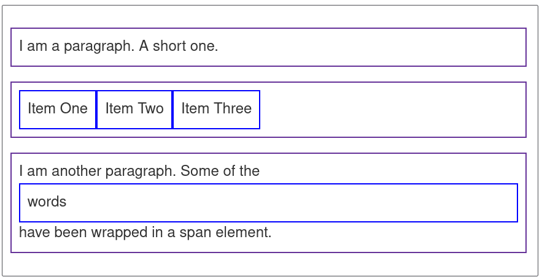

本文按照 Mozilla 贡献者基于 CC-BY-SA 2.5 协议发布的以下文章改编:

- <https://developer.mozilla.org/zh-CN/docs/Learn/CSS/First_steps>
- <https://developer.mozilla.org/zh-CN/docs/Learn/CSS/First_steps/What_is_CSS>
- <https://developer.mozilla.org/zh-CN/docs/Learn/CSS/First_steps/Getting_started>
- <https://developer.mozilla.org/zh-CN/docs/Learn/CSS/First_steps/How_CSS_is_structured>
- <https://developer.mozilla.org/zh-CN/docs/Learn/CSS/Building_blocks/Cascade_and_inheritance>
- <https://developer.mozilla.org/zh-CN/docs/Learn/CSS/Building_blocks/The_box_model>
- <https://developer.mozilla.org/zh-CN/docs/Learn/CSS/First_steps/How_CSS_works>
- <https://developer.mozilla.org/zh-CN/docs/Learn/CSS/First_steps/Using_your_new_knowledge>

本文基于 CC-BY-SA 4.0 协议发布。


# 入门 CSS

## 开始之前

好了，经过了前面的 HTML 学习，我们进入了下一个阶段。在这里，你终于不需要忍受那些白底黑字灰按钮的网页了！这里我们将会介绍 **CSS（Cascading Style Sheets，层叠样式表）**，它用于设置和布置网页————例如，更改内容的字体，颜色，大小和间距，将其拆分为多个列，或添加动画和其他装饰功能。但是，这里我们不会太急，先介绍一点点东西，用来给大家提供一个开端。

大家在用 word 的时候，都是把字选择起来，调节字号，字体一类。在这样的操作中，样式和内容是连在一起的。但是 web 就不太一样，它把内容和样式分开了。基本的 HTML 只有一些主要内容，而样式几乎都是放在 CSS 里面的。这样的好处是维护方便，我们以后会提到。

浏览器在得到一个 HTML 之后，就会开始根据这个文档的结构进行渲染。根据各种标签和 CSS 来确定一个文字应该显示成什么样子，所以你在最终的网页上面看不到 `<p>` 这类的标签。在没有 CSS 的时候，浏览器会采用默认样式进行渲染。而 CSS 则会指定一个 HTML 里的东西应该怎么渲染（当然标记语言不只有 HTML， 还有 XML，SVG 这些，都可以用 CSS）。下面我们简单地讲下语法。

## CSS 语法

CSS 就是指定一种规则。听起来有点迷惑，不过我们举个例子就明白了。征文的时候，老师说，“标题用三号黑体，正文用小四号仿宋”，这样的要求就是规则。本质上这两者都是相同的，只是为了给浏览器看，CSS 用了更复杂的语法。比如下面这个 CSS：

``` css
h1 {
    color: red;
    font-size: 5em;
}
```

用自然语言讲出来就是“把所有的 h1 的颜色变成红色，字体大小变成 5em”。是不是非常简单？下面我们分析一下。  

这里的例子就是一个完整的 CSS 规则。规则以一个 **选择器（selector）** 开头，它选出我们这条规则影响的元素。在这里它是 `h1` ，就是选中所有的一号标题（大标题），让它用上后面紧跟着的大括号内指定的样式。  

选择器后面是一个大括号 `{}`，里面定义一些属性。比如 `color: red` 就把元素的 `color` 属性设置成了 `red`，也就是把颜色设置成红色。我们可以看见冒号前面是属性，冒号后面是值。  

像这样按照 `属性:值 (property:value)` 的格式来指定属性的值句子叫做 **声明（declarations）**。每个声明以半角分号（;）结尾。不同于 HTML 的是，CSS 的属性是**区分大小写**的。

属性的值不是随便设置的，比如你给 `color` 的 `red` 换成 `read` ， `write` 这些乱七八糟的值是没有任何效果的（CSS 会自动忽略那些错误的规则）。如果属性有多个值，那么多个值之间用英文逗号（,）隔开。CSS 当中具有非常多样的属性，给各种元素很大的自定义空间，具体可以查看有关 CSS 的文档（比如 MDN 的文档 <https://developer.mozilla.org/zh-CN/docs/Web/CSS/Reference>）。

一个 CSS 不只有一个规则，它可以包含很多的规则，比如这样：

``` css
h1 {
    color: red;
    font-size: 5em;
}
p {
    color: black;
}
```

这里就多了一个把所有的 `<p>` 里面的字都设置成黑色的规则。

## 属性一览

因为属性太多，我们不可能一下子全部列出。这一系列的教程可能会把属性随着进度慢慢地讲出来。所以我们就先列出一些现在就可以用到的属性。

### color

顾名思义，这就是颜色相关的属性，准确来说这是前景色（通常是文本颜色），还可以用 `background-color` 来设置背景色。刚刚我们提到的是用颜色名称来设置。实际上颜色还可以不止通过这种方式。例如用 `rgb` 或者 `rgba`，或者十六进制颜色值。

``` css
h1 {
  color: rgb(255, 255, 255) /*设置成白色*/
}
p {
  color: rgba(255, 255, 204, 0.8) /*淡黄色 20% 透明*/
}
ul {
  color: #0000FF;/*蓝色*/
}
```

更多的内容可以去 MDN 上搜索 `color` 去看详细的介绍。

### font

font 相关的都是字体的属性。其中包括了字体，字号和类型等等。

设置字体大小使用 `font-size` ，大概就是这样:

``` css
font-size: 12px;/*12 像素大小*/
font-size: 0.8em;/*0.8 字符大小*/
```

其中第一个 `px` 结尾的就是以像素大小为单位的绝对大小，第二个 `em` 是以字号为单位的相对大小。使用相对大小有利于去适应不同的设备，我们推荐使用 `em` 的方式。通常情况下，电脑浏览器上 `1em` 等于 `16px`。

设置字体的是 `font-family` 属性。这个属性可以指定字体。你可以给定一个有先后顺序的，由字体名或者字体族名组成的列表来为选定的元素设置字体。

```
font-family: Georgia, serif; /*使用 Georgia 字体，如果没有选择默认衬线字体*/
font-family: sans-serif;/*使用无衬线字体*/
```

`font-style` 用来设置斜体。例如 `font-style: italic` 设置字体为斜体。

`font-weight` 设置粗体。`font-weight: bold` 将字体设置成粗体。

## 其他的话

这一章不为难大家，干货就到这里。


# 正式开始

经过前一章，我们了解了 CSS 大抵是什么东西。现在就要正式用上 CSS 了。  
在这篇文章中，我们将会拿一个简单的 HTML 文档做例子，并且在上边使用 CSS 样式，期待你能在此过程中学会更多有关 CSS 的实战性知识。  

## 先从 HTML 开始

这里是一个平平无奇的 HTML：  

``` html
<!doctype html>
<html lang="en">
<head>
    <meta charset="utf-8">
    <title>开始学习CSS</title>
</head>
<body>
    <h1>我是一级标题</h1>
    <p>这是一个段落文本. 在文本中有一个 <span>span element</span>并且还有一个 <a href="http://example.com">链接</a>.</p>
    <p>这是第二段. 包含了一个 <em>强调</em> 元素.</p>
    <ul>
        <li>项目1</li>
        <li>项目2</li>
        <li>项目 <em>三</em></li>
    </ul>
</body>
</html>
```

我们将会以这个为例子开始讲解 CSS。  

## 嵌入 CSS

要想让 CSS 应用在 HTML 当中，就需要在其中嵌入 CSS。一共有三种方法可以嵌入 CSS：外部 CSS，内部 CSS，内联 CSS。目前我们最普遍的方式——**外部 CSS** 来进行演示。  
在与之前所说的 HTML 的相同目录下创建一个文件，保存并命名为 `styles.css` 。然后在HTML 的 `<head>` 当中加入这一行:  

``` html
<link rel="stylesheet" href="styles.css">
```

这样就可以将 HTML 和 CSS 文件链接起来。属性 `rel="stylesheet"` 表示要链接的是 CSS 文件，`href` 指定了文件名称。但是你可以把CSS文件放在其他地方，并调整指定的路径以匹配。  
接下来就可以在 styles.css 文件里面指定样式了。前面已经讲过，我们通过指定元素选择器以及附加的规则来格式化 HTML 当中的元素。所以这里就直接开始了。  
比如我们现在可以把下面的内容写进去：  

``` css
h1 {
  color: red;
}
p, li {
    color: green;
}
em {
  font-weight: bold;
  color: grey;
}
```

它把大标题设置成红色，把段落和列表里面的字设置成绿色，再把强调元素设置成灰色粗体。具体效果可以看下面的图片：  


另外，如果之前已经在浏览器里面打开了 HTML 的话，修改之后要保存，然后在浏览器里面刷新才能看到变化。这里是怕大家忘了。

## 元素默认样式

对于每个 HTML ，如果没有 CSS 或者 CSS 没有指定的地方，浏览器都会采用默认样式进行渲染，比如那些标题都是粗体，链接是蓝色带下划线之类。  
如果你不是很满意那些东西，可以用选择器选中它们，再指定一个规则去掉它。比如一个 `ul` 的 `li` 前面会带上一个点，现在我们可以去掉通过这个规则去掉它。  

``` css
li {
  list-style-type: none;
}
```

对其他元素的默认样式也可以采用类似的方式进行去除或者覆盖。

## 使用类名

到现在我们都是采用选择器来指定一个元素。但是如果想要对一些元素起作用，比如一些 `<p>` 变成红色，另一些 `<p>` 变成紫色，怎么办？  
答案是使用**类名（class）**。你可以给 HTML 元素来指定类名，再让 CSS 选择器用类名进行选择。下面是一个例子：

``` html
<ul>
  <li>项目一</li>
  <li class="special">项目二</li>
  <li>项目 <em>三</em></li>
</ul>
```

这里给项目二指定了一个 `class="special"` 。在 CSS 中选中它，需要在选择器开头加上一个英文句点（.），就像这样：

``` css
.special {
  color: orange;
  font-weight: bold;
}
```

把 `special` 类的元素设置成橙色粗体。一个类名可以在不止一中元素上面使用，比方说我们给一些 `<p>` 加上 `class="special"` 之后，这些 `<p>` 也会变成橙色粗体。是不是非常方便。  
有时候你会看见这样的东西：  

``` css
li.special {
  color: orange;
  font-weight: bold;
}
```
这里就是指定所有类为 `special` 的 `li` 元素，不会影响其他的 `special` 类的元素。可以用来给某些特殊元素处理。  

## 根据元素在文档中的位置确定样式

有时候希望某些内容根据它在文档中的位置而有所不同。这里有很多选择器可以提供帮助，但现在我们只介绍几个选择器。比方说现在我们的文档中有两个 `<em>` 元素 ——一个在段落内，另一个在列表项内。如果只想选择嵌套在 `<li>` 元素内的 `<em>` 我们可以使用一个称为**包含选择符**的选择器，它只是单纯地在两个选择器之间加上一个空格。CSS 长这样：  

``` css
li em {
  color: rebeccapurple;
}
```

现在，我们把包含在 `<li>` 当中的 `<em>` 变成了紫色，而其他地方的 `<em>` 都不受影响。  

如果你想要根据严格的父子关系来选择，可以采用**子代选择器**，这个符号是一个 `>`，写出来的选择器就是 `li > em`。这样就不会选出套在 `<span>` 里面的 `<em>` 了。

另外我们也可以让两个同级别元素排在一起的时候再选中，需要在两个选择器之间添加一个 + 号 (成为 **相邻选择符**) 。这里是一个例子：

``` css
h1 + p {
  font-size: 200%;
}
```

当 `h1` 和 `p` 相邻的时候，就把它们的字体都放大到 200%。  

## 根据状态确定样式

我们平时在浏览网页的时候，把鼠标停在某个链接上面，那个链接就会变颜色。这是通过选中不同**状态**来进行的。当我们修改一个链接的样式时，我们需要选中 `<a>` 标签。这个标签有着不同的状态，比如说是否是未访问的、访问过的、被鼠标悬停的、被键盘定位的，亦或是正在被点击当中等等。你可以使用 CSS 去选中这些不同的状态，然后分别进行修饰。比如说下面的 CSS 代码使得没有被访问的链接颜色变为粉色、访问过的链接变为绿色。

``` css
a:link {
  color: pink;
}
a:visited {
  color: green;
}
```

你也可以改变链接被鼠标悬停的时候的样式，例如移除下划线：

``` css
a:hover {
  text-decoration: none;
}
```

## 将多种选择器混合使用

有时候你想去搞一些很复杂的功能，那就可能会需要混合使用多种选择器。  
比如把包含和并列选择器一块用：

``` css
/* 选择在 <article> 中的 <p> 中的 <span>。 */
article p span { ... }
/* 选中排在一起的 <h1> <ul> 和 <p>。 */
h1 + ul + p { ... }
```

或者像这样把一堆选择器混在一起。

``` css
/*在 <body> 之内，紧接在 <h1> 后面的 <p> 元素的内部，类名为 special 。*/
body h1 + p .special {
  color: yellow;
  background-color: black;/*设置背景颜色*/
  padding: 5px;
}
```

这里 `/* */` 包裹起来的内容是 CSS 注释，浏览器会自动忽略这些，写注释是给自己或者其他能看到这个 CSS 的人看的，记下一些比较复杂的东西，免得以后忘记了是吧。

## 总结

这里我们知道了怎么链接 CSS ，以及如何添加选择器来作用特定的元素。在教程的剩下部分，我们将继续这个话题。你现在已经可以在 MDN 文档中查找属性和值，并且根据这个给文本指定简单的样式。

在下一节中，我们将看到样式表的结构是什么样的。


# 进一步的 CSS

现在，你应该已经很了解什么是 CSS 了，对于 CSS 的各种细节也有了一定的把握。我们这一节要告诉你怎么完整地使用 CSS 。

## 其他添加 CSS 的方法

之前我们提到了另外两种方法的存在，现在也稍微提下。

### 内部 CSS

在 HTML 的 `<head>` 里面用 `<style> </style>` 来包裹你的 CSS。
``` html
<!DOCTYPE html>
<html>
  <head>
    <meta charset="utf-8">
    <title>My CSS experiment</title>
    <style>
      h1 {
        color: blue;
        background-color: yellow;
        border: 1px solid black;
      }
      p {
        color: red;
      }
    </style>
  </head>
  <body>
    <h1>Hello World!</h1>
    <p>This is my first CSS example</p>
  </body>
</html>
```

在单文件的时候这个可能会比较方便，但是如果你的网站有很多 HTML ，一个个这么改过来不现实，所以看情况吧。

### 内联 CSS
在单文件的时候这个可能会比较方便，但是如果你的网站有很多
内联 CSS 直接添加在元素上面。比如这样子：

``` html
<!DOCTYPE html>
<html>
  <head>
    <meta charset="utf-8">
    <title>My CSS experiment</title>
  </head>
  <body>
    <h1 style="color: blue;background-color: yellow;border: 1px solid black;">Hello World!</h1>
    <p style="color:red;">This is my first CSS example</p>
  </body>
</html>
```

非常不建议这么做，一个个改元素会成为你的噩梦的。偷懒一时爽，维护火葬场，切记切记。

## 层叠与继承

可能接下来的内容会偏向抽象一些，不过也是可以轻松理解的内容，对以后处理实际问题有很大帮助。

### 一个例子

在写一个项目的时候，我们总是不可避免地会遇到一些问题，比如下面这个例子。

现在有这样的一个元素：

``` html
<p class="special">What color am I?</p>
```

然后有这样的 CSS：

``` css
p {
  color: green;
}
p {
  color: yellow;
}
```

或者 CSS 是这样的：

``` css
.special {
  color: red;
}
p {
  color: blue;
}
```

请问它会变成什么样子？  

我们立刻就会讲解这些细节。

### 层叠

CSS 元素的顺序很重要。浏览器在渲染 CSS 的时候，是从上到下进行解析的，同级的选择器指定的元素，如果样式发生了重复，就会使用后面的元素覆盖掉。就像涂颜料，前面都盖掉了，只有最后的才会看见。

刚刚那个例子的第一个，就是典型的层叠。所以自然颜色就变成了黄色。

### 优先级

那么第二个 CSS 要怎么处理呢，就要考虑**优先级**的问题了。

一般情况下面，越特殊的选择器，优先级就越高。在这里，`.special` 作为一个类名选择器，比 `p` 这样的元素选择器更加特殊，所以优先级更高。CSS 内置的优先级比较复杂，就不详细展开了。

当然以后这类问题实在不知道的话，可以自己直接在浏览器里面试一下。这也是常用的手段，比起看一些晦涩的文档，也不失为一种更好的选择。

### 继承

有时候，子元素会**继承**父元素的一部分属性。最典型就就是 `font` 系列。比方说你写了这样的 HTML 和 CSS：

```html
<p> 我是一段文字，里面有<b>粗体</b>，<i>斜体</i>。 </p>
```

``` css
p {
  font-family: tahoma；/*这个是 Windows 默认字体*/
}
```

显然，里面的粗体和斜体都会和 `<p>` 中其他字有一样的字体。这样可以免掉很多麻烦。不过更加常用的方式就是直接给 `<body>` 设置这些属性，可以给包含在里面的全部内容继承。

有些属性是不会继承的，是否继承之类的问题都会在文档里面写明，用到的时候查下文档就好。

不想继承的话，一般是把这个属性覆盖了就好了，具体控制继承的方式，也可以看下文档。

## 盒模型

在 CSS 中，所有的元素都是套在**盒子（box）**里面的。盒子是渲染的基本单位，是处理元素的时候用到的。我们有时候有排版网页的需求，比方说放上一张图片，指定宽度高度，或者是一块一块地排上一些方格，比如写博客的时候一篇篇文章排下来之类的，都会用到盒子。

盒子分成两种，**块级盒子 (block box)** 和 **内联盒子 (inline box)** 。

让我们先开始了解盒模型。

### 盒模型

完整的 CSS 盒模型，是盒子里面套着盒子的，这些不断嵌套的盒子构成了 CSS 的基本框架。从里到外包含这些部分：

- Content box: 这个区域是用来显示内容，大小可以通过设置 width 和 height.
- Padding box: 包围在内容区域外部的空白区域； 大小通过 padding 相关属性设置。
- Border box: 边框盒包裹内容和内边距。大小通过 border 相关属性设置。
- Margin box: 这是最外面的区域，是盒子和其他元素之间的空白区域。大小通过 margin 相关属性设置。


在标准模型中，如果你给盒设置 width 和 height，实际设置的是 content box, 也就是内容那个盒子。 padding 和 border 再加上设置的宽高才一起决定整个盒子的大小。比方说可以这样设置：

``` css
.box {
  width: 350px;
  height: 150px;
  margin: 25px;
  padding: 25px;
  border: 5px solid black;
}
```

这里最内层的 content box 是分别设置宽高的，而其他都指定宽度（相当于边框的粗细）。在页面中显示出来的是最内层和边框，别的相当于占着的空白。合起来在页面里面占的宽度是 350 + 25 + 25 + 5 + 5 = 410px，高度是 150 + 25 + 25 + 5 + 5 = 210px。

> margin 不计入实际大小 —— 当然，它会影响盒子在页面所占空间，但是影响的是盒子外部空间。盒子的范围到边框为止 —— 不会延伸到 margin。如果两个相邻元素都在其上设置外边距，并且两个外边距接触，则两个外边距中的较大者保留，较小的一个消失——这叫外边距折叠。


其实更好的方法是使用相对大小来设置，比如设置百分数 `50%` 或者相对字体的大小 `2em` 之类。因为这样可以在多种尺寸的屏幕上面显示地正常一些。具体可以从**相应式布局**了解有关细节。通常， `1em` 等于 `16px`。

### 块级盒子和内联盒子

这两种盒子会在**页面流（page flow）**和元素之间的关系方面表现出不同的行为:

一个被定义成块级的（block）盒子会表现出以下行为:

- 盒子会在内联的方向上扩展并占据父容器在该方向上的所有可用空间，在绝大数情况下意味着盒子会和父容器一样宽
- 每个盒子都会换行
- width 和 height 属性可以发挥作用
- 内边距（padding）, 外边距（margin） 和 边框（border） 会将其他元素从当前盒子周围“推开”

除非特殊指定，诸如标题( `<h1>`等)和段落(`<p>`)默认情况下都是块级的盒子。

如果一个盒子对外显示为内联（inline），那么它的行为如下:

- 盒子不会产生换行。
-  width 和 height 属性将不起作用。
- 垂直方向的内边距、外边距以及边框会被应用但是不会把其他处于 inline 状态的盒子推开。
- 水平方向的内边距、外边距以及边框会被应用且会把其他处于 inline 状态的盒子推开。

用做链接的 `<a>` 元素、 `<span>`、 `<em>` 以及 `<strong>` 都是默认处于 inline 状态的。

我们通过对盒子 display 属性的设置，比如 inline 或者 block ，来控制盒子的外部显示类型。

### 盒子排版示例

现在我们看下一些关于 block box 的例子。

第一个例子是一个段落，我们给它设置了边框。因为它是一个块级元素，所以它被换了个行。  
第二个例子是一个列表，它被设置了一个 `display: flex`，意思是里面的元素按照弹性布局，所以里面的各个 `li` 就会被从左到右排成一行。不过它本身仍然是一个块，和段落一样，最外面也是换了一个行的。  
第三个例子是演示内联元素如何变成块级。里面有两个 <span> 元素。正常情况下是 inline，但是其中一个加了 `block` 类，设置属性 `display: block`，成了块级元素。



``` css
p, ul {
  border: 2px solid rebeccapurple;
  padding: .5em;
}
.block, li {
  border: 2px solid blue;
  padding: .5em;
}
ul {
  display: flex;
  list-style: none;
}
.block {
  display: block;
}          
```

``` html
<p>I am a paragraph. A short one.</p>
<ul>
  <li>Item One</li>
  <li>Item Two</li>
  <li>Item Three</li>
</ul>
<p>I am another paragraph. Some of the <span class="block">words</span> have been wrapped in a <span>span element</span>.</p>
```

我们可以看到 inline 元素在下面例子中的表现。 `<span>` 在第一段默认是内联元素所以不换行。  
还有一个 `<ul>` 设置为 display: inline-flex，使得在一些flex元素外创建一个内联框，表现成内联。  
最后设置两个段落为 display: inline。 inline flex 容器和段落在一行上而不是像块级元素一样换行。


``` css
p, ul {
  border: 2px solid rebeccapurple;
}
span, li {
  border: 2px solid blue;
}
ul {
  display: inline-flex;
  list-style: none;
  padding: 0;
}
.inline {
  display: inline;
}
```

``` html
<p>
    I am a paragraph. Some of the
    <span>words</span> have been wrapped in a
    <span>span element</span>.
</p>     
<ul>
  <li>Item One</li>
  <li>Item Two</li>
  <li>Item Three</li>
</ul>
<p class="inline">I am a paragraph. A short one.</p>
<p class="inline">I am another paragraph. Also a short one.</p>
```

在后面的内容中会遇到诸如弹性盒子布局的内容；现在需要记住的是， display 属性可以改变盒子的外部显示类型是块级还是内联，这将会改变它与布局中的其他元素的显示方式。

## 再谈属性和值

我们之前已经了解过，CSS 的声明是由属性和值组成的。格式是 `属性: 值`。

每个属性都有定义的值，对应特定的样式。

如果属性未知或某个值对给定属性无效，则声明被视为无效，并被浏览器的 CSS 引擎完全忽略。

接下来就要再提一下属性，讲一些之前没有提到的内容。

### 一些重要属性

试试看这些属性吧，查找 MDN 的文档，并且试着使用它们。

- font-size
- width
- background-color
- color
- border

### 函数

虽然大多数值是相对简单的关键字或数值，但也有一些可能的值以函数的形式出现。函数由函数名和括号组成，括号内是函数的参数。比如我们之前提到的 `color` 里面的 `rgba()` 就是一个很典型的 CSS 函数。这里我们演示一下 `calc()` 函数。这个函数允许您在 CSS 中进行简单的计算，例如：

``` html
<div class="outer"><div class="box">The inner box is 90% - 30px.</div></div>
```

``` css
.outer {
  border: 5px solid black;
}

.box {
  padding: 10px;
  width: calc(90% - 30px);
  background-color: rebeccapurple;
  color: white;
}
```


在上面的 `calc()` 示例中，我要求此框的宽度为包含块宽度的 90% ，减去 30 像素。这不是我可以提前计算的东西，只是在 CSS 中输入值，因为我不知道 90% 会是什么。MDN 上的相关页面将有使用示例，这样您就可以看到函数是如何工作的。

还有 `transform`, `background-image`, `color` 这些也用了函数，可以看文档了解一下。

### @规则

到目前为止，我们还没有遇到 `@rules` (读音 "at-rules")。 这是一些特殊的规则，为 CSS 提供了一些关于如何表现的指导。 有些 `@rules` 规则很简单，只有规则名和值。例如，要将额外的样式表 (假定叫做 `styles2.css` ) 导入主 CSS 样式表，可以使用 `@import`:

``` css
@import 'styles2.css';
```

最常见的 `@rules` 之一是 `@media` ，它允许您使用 媒体查询 来应用 CSS。意思是仅当某些条件成立(例如，当屏幕分辨率高于某一数量，或屏幕宽度大于某一宽度时)的时候才会用到这个规则。这样可以用来适应不同的设备（比如竖屏和横屏）。

在下面的 CSS 中，我们将给 `<body>` 元素一个粉红色的背景色。但是，我们随后使用 `@media` 创建样式表的一个部分，该部分仅适用于视口大于 30em 的浏览器。如果浏览器的宽度大于 30em，则背景色将为蓝色。

``` css
body {
  background-color: pink;
}

@media (min-width: 30em) {
  body {
    background-color: blue;
  }
}
```

### 速记属性

有时候一个个指定属性是一件很烦的事情，现在我要设置一个 padding 的上下左右边距：

``` css
.box{
    padding-top: 10px;
    padding-right: 15px;
    padding-bottom: 15px;
    padding-left: 5px;
}
```

CSS 本就有些无聊，要是再加上这些杂七杂八的东西不会乱成一团就怪了。好在为了程序员们的眼睛和头发，有个叫做**速记属性**的东西。它可以使代码更整洁，也节约你的打字时间。上面的例子可以打成这样：

``` css
.box{
    padding: 10px 15px 15px 5px;
}
```

> 警告：虽然速记经常允许您忽略值，但它们会将不包含的任何值重置为它们的初始值。这确保使用了一组合理的值。但是，如果您期望速记只更改传入的值，这可能会使您感到困惑。

## 注释和空白

CSS 中的注释以 `/*` 开头，以 `*/` 结尾。注释内容不会被 CSS 渲染。

添加注释是一件有用的事情，这样做可以帮助您在过了几个月后回来修改或优化代码时了解它们是如何工作的，同时也便于其他人理解您的代码。有时候测试的时候也会把一些属性包在注释里面禁用掉，用来排除干扰，也就是常说的“注释掉”。

比如这就是典型的用法：

``` css
/*.special {
  color: red;
}*/
p {
  color: blue;
}
```

空白是指实际空格、制表符和换行。以与 HTML 相同的方式，浏览器往往忽略 CSS 中的大部分空白；许多空白只是为了提高可读性。

## 小结

本章内容有点多有点杂，在此稍微梳理一下。

应用 CSS 有三种方法。外部 CSS，内部 CSS， 内联 CSS。推荐使用的是外部 CSS，因为方便维护和复用。

如果多个选择器选中了同一个元素，这些选择器跟着的规则也发生冲突的话，CSS 将会根据优先级处理。通常是后面的覆盖前面的，特殊的覆盖一般的，最后显示出来网页的样子。  

CSS 在渲染的时候使用盒模型，这个模型把元素看成是一个一个的盒子，将它们排布起来。盒子分成两种，一种是块级盒子，另一种是内联盒子。块级盒子通常会自带换行，并且拥有完整的边框。

属性除了普通的值，还可以有函数。函数通常指定一些比较复杂的逻辑。除了普通的属性之外，还有 @ 属性，用来进行一些特殊的操作。

空白和注释是让 CSS 提高可读性的重要方式。

## 结尾

现在你应该知道了 CSS 的一些工作原理，下面我们就进入实战部分吧。

# 实战

祝贺大家！经过了前面的学习，我们终于来到了实战部分，现在你可以初步搭建一个自己的网站了！

## 浏览器解析 CSS

在开始之前，我们有必要了解一下浏览器是怎么解析 CSS 的。

当浏览器展示一个文件的时候，它必须兼顾文件的内容和文件的样式信息，下面我们会了解到它处理文件的标准的流程。需要知道的是，下面的步骤是浏览加载网页的简化版本，而且不同的浏览器在处理文件的时候会有不同的方式，但是下面的步骤基本都会出现。

- 浏览器载入 HTML 文件（比如从网络上获取）。
- 将HTML文件转化成一个 DOM（Document Object Model），DOM是文件在计算机内存中的表现形式。
- 接下来，浏览器会拉取该HTML相关的大部分资源，比如嵌入到页面的图片、视频和 CSS 样式。JavaScript 则会稍后进行处理，简单起见，同时此节主讲 CSS ，所以这里对如何加载 JavaScript 不会展开叙述。
- 浏览器拉取到CSS之后会进行解析，根据选择器的不同类型（比如 element、class、id 等等）把他们分到不同的“桶”中。浏览器基于它找到的不同的选择器，将不同的规则（基于选择器的规则，如元素选择器、类选择器、id选择器等）应用在对应的DOM的节点中，并添加节点依赖的样式（这个中间步骤称为渲染树）。
- 上述的规则应用于渲染树之后，渲染树会依照应该出现的结构进行布局。
- 网页展示在屏幕上（这一步被称为着色）。

上面看不太懂也没事，有个概念就可以，方便自己以后调试网站的时候更快地了解到问题。

### 浏览器如何对待错误的 CSS

如果浏览器在加载 CSS 的时候发现了一些错误，比方说属性拼写错误，或者选择器错误，会怎么做？

你也许猜到了：浏览器什么也不做，直接跳过去！就像这个 CSS：

``` css
p {
  font-weight: bold;
  colour: blue; /* color 属性的不规范拼写 */
  font-size: 200%;
}
fkccf {
  border: 1px solid black;
  background-color: lime;
}
```

在第一个例子，我们使用了不规范的拼写 `colour` （CSS 只支持美式英语），然后浏览器会直接忽略这个规则，跳过去，于是段落就变成了放大 200% 的粗体，用的默认颜色（一般是黑色）。

第二个例子，我们使用了错误的选择器。这导致这个规则被忽略，包括大括号里面跟着的那些规则。

注意，这里**不会有报错**，而是直接忽略，所以你不会从控制台或者调试窗口或者什么地方得到这个属性没有被渲染的消息，只能从最后元素的样式去判断。

如果你想对某些上古浏览器进行支持（比如某毒瘤 IE6），那么这种特性会比较有用。比方说某个浏览器是没有 `calc` 这个函数的，它就会使用上面的 500px，而正常浏览器则会正常解析下面的 `calc`，并且显示出来。

``` css
.box {
  width: 500px;
  width: calc(100% - 50px);
}
```

## 实战例子

现在，我们正式开始实战。

我们强烈建议你在计算机上进行实际操作，毕竟实操和看看是有很大区别的。我们此处的例子是从 MDN 的对应章节（MDN -> 学习 Web 开发 -> CSS -> CSS 第一步 -> 运用你的新知识，<https://developer.mozilla.org/zh-CN/docs/Learn/CSS/First_steps/Using_your_new_knowledge>）里面摘出来的，你可以选择从那里直接复制代码，然后照着链接里面的说明进行操作。

现在你应该可以理解下面的 html 和 css，以及它们显示出来的样子。新建一个文件夹，在里面建立下面这两个文件，再在浏览器里面打开 index.html ，看看是不是显示出图片里面的样子。

index.html

``` html
<!doctype html>
<html lang="en">
  <head>
    <meta charset="utf-8">
    <title>Formatting a biography</title>
    <link rel="stylesheet" href="styles.css">
  </head>
  <body>
    <h1>Jane Doe</h1>
    <div class="job-title">Web Developer</div>
    <p>Far far away, behind the word mountains, far from the countries Vokalia and Consonantia, there live the blind texts. Separated they live in Bookmarksgrove right at the coast of the Semantics, a large language ocean.</p>
    <p>A small river named Duden flows by their place and supplies it with the necessary regelialia. It is a paradisematic country, in which roasted parts of sentences fly into your mouth.
    </p>
    <h2>Contact information</h2>
    <ul>
      <li>Email:
        <a href="mailto:jane@example.com">jane@example.com</a>
      </li>
      <li>Web:
        <a href="http://example.com">http://example.com</a>
      </li>
      <li>Tel: 123 45678</li>
    </ul>
  </body>
</html>
```

styles.css

``` css
body {
  background-color: #fff;
  color: #333;
  font-family: Arial, Helvetica, sans-serif;
  padding: 1em;
  margin: 0;
}
h1 {
  color: #375e97;
  font-size: 2em;
  font-family: Georgia, 'Times New Roman', Times, serif;
  border-bottom: 1px solid #375e97; /*下边框，从左到右三个依次是边框粗细大小，
  边框样式和颜色。比如要换成点线边框的样式就把 solid 换成 dotted*/
}
h2 {
  font-size: 1.5em;
}
.job-title {
  color: #999999;
  font-weight: bold;
}
a:link, a:visited {
  color: #fb6542;
}
a:hover {  /*鼠标悬停*/
  text-decoration: none; /*文本修饰: none*/
}
```


现在你可以尝试对它进行一系列的操作，看看它会变成什么样子。比方说你可以这么做（不知道怎么做的往前翻，都讲过。这里是个练习，不提供示例代码）：

- 使用 CSS 的颜色关键词 `hotpink` ，将一级标题设定为粉红色。
- 使用 CSS 颜色关键词 `purple` ，为标题添加 10 像素宽的点线边距（注释里面有提到的）
- 将二级标题设为斜体（`font-style: italic`）。
- 用 `#eeeeee` 为联系人列表中的超链接添加背景颜色和一个 5 像素宽的紫色加粗边框 (border)。使用一些内边距 (padding) 属性，拉开正文与外边距的距离。
- 当鼠标在某些 HTML 元素上悬停时增加动画 (推荐改变颜色和字体试试)。
- 设置链接在鼠标悬停时变为绿色。

然后就会变成这样


## 结束了？

"好像内容是结束了？那我是不是可以自己搭建一个网站了？"

如果说是搭建一个初步的网站，那么的确是可以了。但是有的网站好像不是那么简单，比方说导航栏，侧栏，底栏这些，要怎么办？下面我们会举出更多例子。

在更下面我们会把更加综合地讲解一下 HTML 和 CSS 的合作的例子，给大家一些网站的例子去讲解。
