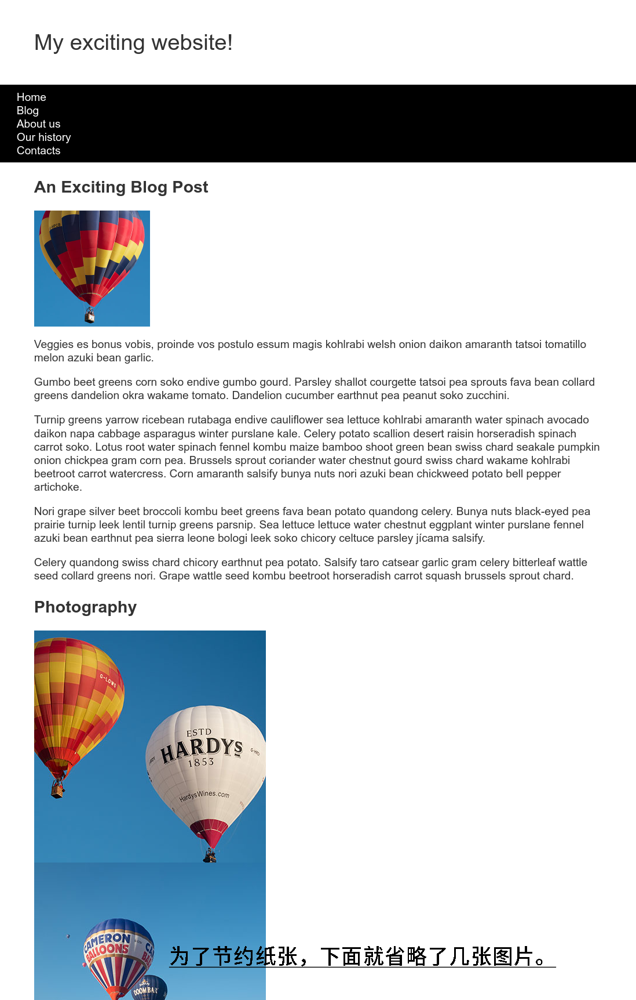

本文按照 Mozilla 贡献者基于 CC-BY-SA 2.5 协议发布的以下文章改编:

- <https://developer.mozilla.org/zh-CN/docs/Learn/CSS/CSS_layout/Fundamental_Layout_Comprehension>

本文基于 CC-BY-SA 4.0 协议发布。

# 基础布局练习

这里我们找了 MDN 上面的一个例子，给大家来讲解一下这个具体的网站。

我们要做一个这样的网页：


你可以从 <https://github.com/mdn/learning-area/tree/master/css/css-layout/fundamental-layout-comprehension> 来下载基础的 HTML 和 CSS 资源。为了方便大家我们这里直接列出下面的基础 HTML 和 CSS，图片就先不放了，这些图片都存在 index.html 同目录下的 images 文件夹里面。下面的演示图片是下列 HTML 和 CSS 显示出来的样子。

``` html
<!DOCTYPE html>
<html>
<head>
  <meta charset="utf-8">
  <meta name="viewport" content="width=device-width, initial-scale=1">
  <title>Layout Task</title>
  <link href="styles.css" rel="stylesheet" type="text/css">
</head>
<body>
  <div class="logo">My exciting website! </div>
  <nav>
    <ul>
      <li> <a href="">Home</a> </li>
      <li> <a href="">Blog</a> </li>
      <li> <a href="">About us</a> </li>
      <li> <a href="">Our history</a> </li>
      <li> <a href="">Contacts</a> </li>
    </ul>
  </nav>
  <main class="grid">
    <article>
      <h1>An Exciting Blog Post</h1>
      
      <p>Veggies es bonus vobis, proi(省略)...</p>
      <p>Gumbo beet greens corn sosdw....</p>
      <p>Turnip greens yarrow ricebea...</p>
      <p>Nori grape silver beet brocc...</p>
      <p>Celery quandong swiss chard ...</p>
    </article>
    <aside>
      <h2>Photography</h2>
      <ul class="photos">
        <li>  </li>
        <li>  </li>
        <li>  </li>
        <li>  </li>
        <li>  </li>
      </ul>
    </aside>
  </main>
</body>
</html>
```

``` css
body {
  background-color: #fff;
  color: #333;
  margin: 0;
  font: 1.2em / 1.2 Arial, Helvetica, sans-serif;
}
img {
  max-width: 100%;
  display: block;
}
.logo {
  font-size: 200%;
  padding: 50px 20px;
  margin: 0 auto;
  max-width: 980px;
}
.grid {
  margin: 0 auto;
  padding: 0 20px;
  max-width: 980px;
}
nav {
  background-color: #000;
  padding: .5em;
}
nav ul {
  margin: 0;
  padding: 0;
  list-style: none;
}
nav a {
  color: #fff;
  text-decoration: none;
  padding: .5em 1em;
}
.photos {
  list-style: none;
  margin: 0;
  padding: 0;
}
.feature {
  width: 200px;
}
```

将以上的 HTML 和 CSS 分别复制到 index.html 和 styles.css 里面，在浏览器里打开 index.html 就可以看到下面的内容。



现在有这些要求：


1. 在一行中显示导航选项，并且选项之间拥有相同的空间。
2. 导航条应随着内容一起滚动并且在触碰到视口顶部之后于顶部固定。
3. 文章内的图片应该被文本包围。
4. `<article>` 与 `<aside>` 元素应该为双列布局。它们的列尺寸应该是弹性的，以便在浏览器窗口收缩得更小的时候能够变窄。
5. 照片应该以有 1px 间隔的两列网格显示出来。

在实现布局的过程中你不需要修改 HTML，而是通过 CSS 相关的技术来解决。如果忘记了可以回头看布局和定位篇的内容。

那么我们下面给出对每个要求逐个给出步骤。

对与第一点，我们用到了 Flexbox，也就是弹性盒子。我们应该将顶栏 `<nav>` 里面的 `<ul>` 加上一个 `display: flex;` 声明，表示 `<ul>` 子元素使用弹性盒子来进行布局。再给 `<ul>` 里面的 `<li>` 加上 `flex: 1;` ，让它们都占用相同大小的空间。

第二点，我们采用粘性定位技术，给顶栏 `<nav>` 加上 `position: sticky;` 声明，采用粘性定位。加上 `top: 0px;` 和 `left: 0px;` 指定固定的位置为页面最上方 `0px` 处（也就是贴着边框）。

第三点要用到浮动（Float），这里我们给和文字在一起的那张图片，也就是类名为 `.feature` 的那张，指定浮动。使用声明 `float: left;` 来让元素向左浮动，为了不和文字贴在一起，我们设置了 `margin-right: 30px;` 排开右边的文字 30 像素。

第四点和第五点都要用到 Grid 来布局。

`<article>` 与 `<aside>` 元素都被一个类名为 `.grid` 的 `<main>` 包裹在内，所以我们要先把 `.main` 指定成一个 Grid 。添加 `display: grid;` 指定使用 Grid 布局，再用 `grid-template-columns: 2fr 1fr;` 指定一共有两列，两列宽度比例是 2:1 ，`grid-gap: 10px;` 表示两列之间间隔 `10px` 。

同理，对于 `.photos` 这个容器，我们也要使用 `display: grid;`，使用 `grid-template-columns: 1fr 1fr;` 表示有 1:1 的两列，再用 `grid-gap: 1px;` 指定间隔为 `1px` 。

合起来的 CSS 如下。只要将其复制到原来的 CSS 下面就行，无需改动原先 CSS 。

``` css
/*第一点 使用的是子代选择器*/
nav > ul {
  display: flex;
}
nav > ul > li {
  flex: 1;
}
/*第二点*/
nav {
  position: sticky;
  top: 0px;
  left: 0px;
}
/*第三点*/
.feature {
  float: left;
  margin-right: 30px;
}
/*第四点*/
.grid {
  display: grid;
  grid-template-columns: 2fr 1fr;
  grid-gap: 10px;
}
/*第五点*/
.photos{
  display: grid;
  grid-gap: 1px;
  grid-template-columns: 1fr 1fr;
}
```

这里只是我个人的例子，如果你们有什么别的方式可以达成，也可以自己试一下，毕竟没有什么标准答案，只要显示出来是符合要求的，就可以算作答案的一种。

以后大家可以去参考其他的网站，自己尝试搭建一些网页。

## 总结

学到现在，我虽然不能保证大家完全掌握 CSS (事实上也根本不可能完全掌握)，但是用 CSS 去做一些基础的网站是绝对绰绰有余了。到现在，你已经有了掌握其他更加高级的 CSS 知识的能力，理论上能够实现绝大多数的静态网站的需求了。

要知道，在实践过程中，很多时候，不同于平日里的考试，要做的一些事情，很少是有你完全掌握的，都是靠着边学边做，一点点摸索。我这里给大家整理出来的教程里有很多东西，真正去实践的时候，可能又会遇到更多不懂的东西。而且 Web 技术日新月异，我这里讲的东西，过个几年又要过时了。所以要摆好心态，做好不断学习新技术的准备。

到了这里，Web 技术的三层蛋糕的第二层，我们已经吃下来了，下面我会继续带大家去学习 JavaScript，把最后一块拼图拼上之后，我们就可以去做一些真正的实用项目了。而且 Web 技术适用范围是最广的，从搭建网站，到开发一个桌面应用(VSCode 就是基于 Web 技术的)或者 APP，或是去做一系列的服务端程序，都可以用 Web 实现。

祝贺大家顺利完成 CSS 部分！

—— NetherMobs, 2021 年 10 月 1 日
