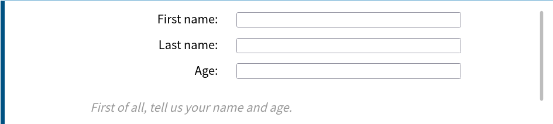
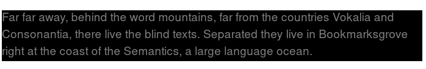

# 入门 CSS

## 开始之前

好了，经过了前面的 HTML 学习，我们进入了下一个阶段。在这里，你终于不需要忍受那些白底黑字灰按钮的网页了！这里我们将会介绍 **CSS（Cascading Style Sheets，层叠样式表）**，它用于设置和布置网页————例如，更改内容的字体，颜色，大小和间距，将其拆分为多个列，或添加动画和其他装饰功能。但是，这里我们不会太急，先介绍一点点东西，用来给大家提供一个开端。

大家在用 word 的时候，都是把字选择起来，调节字号，字体一类。在这样的操作中，样式和内容是连在一起的。但是 web 就不太一样，它把内容和样式分开了。基本的 HTML 只有一些主要内容，而样式几乎都是放在 CSS 里面的。这样的好处是维护方便，我们以后会提到。

浏览器在得到一个 HTML 之后，就会开始根据这个文档的结构进行渲染。根据各种标签和 CSS 来确定一个文字应该显示成什么样子，所以你在最终的网页上面看不到 `<p>` 这类的标签。在没有 CSS 的时候，浏览器会采用默认样式进行渲染。而 CSS 则会指定一个 HTML 里的东西应该怎么渲染（当然标记语言不只有 HTML， 还有 XML，SVG 这些，都可以用 CSS）。下面我们简单地讲下语法。至于怎么添加 CSS，我们会在下一章正式进行讲解。

## CSS 语法

CSS 就是指定一种规则。听起来有点迷惑，不过我们举个例子就明白了。征文的时候，老师说，“标题用三号黑体，正文用小四号仿宋”，这样的要求就是规则。本质上这两者都是相同的，只是为了给浏览器看，CSS 用了更复杂的语法。比如下面这个 CSS：

``` css
h1 {
    color: red;
    font-size: 5em;
}
```

用自然语言讲出来就是“把所有的 h1 的颜色变成红色，字体大小变成 5em”。是不是非常简单？下面我们分析一下。  

这里的例子就是一个完整的 CSS 规则。规则以一个 **选择器（selector）** 开头，它选出我们这条规则影响的元素。在这里它是 `h1` ，就是选中所有的一号标题（大标题），让它用上后面紧跟着的大括号内指定的样式。  

选择器后面是一个大括号 `{}`，里面定义一些属性。比如 `color: red` 就把元素的 `color` 属性设置成了 `red`，也就是把颜色设置成红色。我们可以看见冒号前面是属性，冒号后面是值。  

像这样按照 `属性:值 (property:value)` 的格式来指定属性的值句子叫做 **声明（declarations）**。每个声明以半角分号（;）结尾。不同于 HTML 的是，CSS 的属性是**区分大小写**的。

属性的值不是随便设置的，比如你给 `color` 的 `red` 换成 `read` ， `write` 这些乱七八糟的值是没有任何效果的（CSS 会自动忽略那些错误的规则）。如果属性有多个值，那么多个值之间用英文逗号（,）隔开。CSS 当中具有非常多样的属性，给各种元素很大的自定义空间，具体可以查看有关 CSS 的文档（比如 MDN 的文档 <https://developer.mozilla.org/zh-CN/docs/Web/CSS/Reference>）。

一个 CSS 不只有一个规则，它可以包含很多的规则，比如这样：

``` css
h1 {
    color: red;
    font-size: 5em;
}
p {
    color: black;
}
```

这里就多了一个把所有的 `<p>` 里面的字都设置成黑色的规则。

## 属性一览

因为属性太多，我们不可能一下子全部列出。这一系列的教程可能会把属性随着进度慢慢地讲出来，而不是单独分成一个专题。所以

### color

顾名思义，这就是颜色相关的属性，准确来说这是前景色（通常是文本颜色），还可以用 `background-color` 来设置背景色。刚刚我们提到的是用颜色名称来设置。实际上颜色还可以不止通过这种方式。例如用 `rgb` 或者 `rgba`，或者十六进制颜色值。

``` css
h1 {
  color: rgb(255, 255, 255) /*设置成白色*/
}
p {
  color: rgba(255, 255, 204, 0.8) /*淡黄色 20% 透明*/
}
ul {
  color: #0000FF;/*蓝色*/
}
```

更多的内容可以去 MDN 上搜索 `color` 去看详细的介绍。

### font

font 相关的都是字体的属性。其中包括了字体，字号和类型等等。

设置字体大小使用 `font-size` ，大概就是这样:

``` css
font-size: 12px;/*12 像素大小*/
font-size: 0.8em;/*0.8 字符大小*/
font-size: 200%;/*缩放 200% */
```

其中第一个 `px` 结尾的就是以像素大小为单位的绝对大小，第二个 `em` 是以字号为单位的相对大小。使用相对大小有利于去适应不同的设备，我们推荐使用 `em` 的方式。通常情况下，电脑浏览器上 `1em` 等于 `16px`。如果对个别字进行操作，也可以是使用缩放。

设置字体的是 `font-family` 属性。这个属性可以指定字体。你可以给定一个有先后顺序的，由字体名或者字体族名组成的列表来为选定的元素设置字体。

```
font-family: Georgia, serif; /*使用 Georgia 字体，如果没有选择默认衬线字体*/
font-family: sans-serif;/*使用无衬线字体*/
```

`font-style` 用来设置斜体。例如 `font-style: italic` 设置字体为斜体。

`font-weight` 设置粗体。`font-weight: bold` 将字体设置成粗体。

## 最后

我们会在下一章开始正式运用 CSS 到我们的网页上面。

# 正式开始

经过前一章，我们了解了 CSS 大抵是什么东西。现在就要正式用上 CSS 了。  
在这篇文章中，我们将会拿一个简单的 HTML 文档做例子，并且在上边使用 CSS 样式，期待你能在此过程中学会更多有关 CSS 的实战性知识。  

## 先从 HTML 开始

这里是一个平平无奇的 HTML：  

``` html
<!doctype html>
<html lang="en">
<head>
    <meta charset="utf-8">
    <title>开始学习CSS</title>
</head>
<body>
    <h1>我是一级标题</h1>
    <p>这是一个段落文本. 在文本中有一个 <span>span element</span>并且还有一个 <a href="http://example.com">链接</a>.</p>
    <p>这是第二段. 包含了一个 <em>强调</em> 元素.</p>
    <ul>
        <li>项目1</li>
        <li>项目2</li>
        <li>项目 <em>三</em></li>
    </ul>
</body>
</html>
```

我们将会以这个为例子开始讲解 CSS。  

## 嵌入 CSS

要想让 CSS 应用在 HTML 当中，就需要在其中嵌入 CSS。一共有三种方法可以嵌入 CSS：外部 CSS，内部 CSS，内联 CSS。目前我们最普遍的方式——**外部 CSS** 来进行演示。  
在与之前所说的 HTML 的相同目录下创建一个文件，保存并命名为 `styles.css` 。然后在HTML 的 `<head>` 当中加入这一行:  

``` html
<link rel="stylesheet" href="styles.css">
```

这样就可以将 HTML 和 CSS 文件链接起来。属性 `rel="stylesheet"` 表示要链接的是 CSS 文件，`href` 指定了文件名称。一定要注意的是，这里用来指定文件名的是 `href` 标签，而不是 `src`，两者是有区别的。但是你可以把CSS文件放在其他地方，并调整指定的路径以匹配。  
接下来就可以在 styles.css 文件里面指定样式了。前面已经讲过，我们通过指定元素选择器以及附加的规则来格式化 HTML 当中的元素。所以这里就直接开始了。  
比如我们现在可以把下面的内容写进去：  

``` css
h1 {
  color: red;
}
p, li {
  color: green;
}
em {
  font-weight: bold;
  color: grey;
}
```

它把大标题设置成红色，把段落和列表里面的字设置成绿色，再把强调元素设置成灰色粗体。具体效果可以看下面的图片：  


另外，如果之前已经在浏览器里面打开了 HTML 的话，修改之后要保存，然后在浏览器里面刷新才能看到变化。这里是怕大家忘了。

## 元素默认样式

对于每个 HTML ，如果没有 CSS 或者 CSS 没有指定的地方，浏览器都会采用默认样式进行渲染，比如那些标题都是粗体，链接是蓝色带下划线之类。  
如果你不是很满意那些东西，可以用选择器选中它们，再指定一个规则去掉它。比如一个 `ul` 的 `li` 前面会带上一个点，现在我们可以去掉通过这个规则去掉它。  

``` css
li {
  list-style-type: none;
}
```

对其他元素的默认样式也可以采用类似的方式进行去除或者覆盖。

## 使用类名

到现在我们都是采用选择器来指定一个元素。但是如果想要对一些元素起作用，比如一些 `<p>` 变成红色，另一些 `<p>` 变成紫色，怎么办？  
答案是使用**类名（class）**。你可以给 HTML 元素来指定类名，再让 CSS 选择器用类名进行选择。下面是一个例子：

``` html
<ul>
  <li>项目一</li>
  <li class="special">项目二</li>
  <li>项目 <em>三</em></li>
</ul>
```

这里给项目二指定了一个 `class="special"` 。在 CSS 中选中它，需要在选择器开头加上一个英文句点（.），就像这样：

``` css
.special {
  color: orange;
  font-weight: bold;
}
```

把 `special` 类的元素设置成橙色粗体。一个类名可以在不止一中元素上面使用，比方说我们给一些 `<p>` 加上 `class="special"` 之后，这些 `<p>` 也会变成橙色粗体。是不是非常方便。  
有时候你会看见这样的东西：  

``` css
li.special {
  color: orange;
  font-weight: bold;
}
```
这里就是指定所有类为 `special` 的 `li` 元素，不会影响其他的 `special` 类的元素。可以用来给某些特殊元素处理。  

## 使用 ID

你也可以使用 ID 来选择指定的元素，使用 `#` 开头，类似类名选择器。例如有这么一个 HTML 片段：

``` html
<span id="identified">Here's a span with some text.</span>
```

要想选中它，就可以这么做：

``` css
#identified {
  background-color: DodgerBlue;
}
```

和类名不同的是，一个 ID 是只能给一个标签用的。

## 根据元素在文档中的位置确定样式

有时候希望某些内容根据它在文档中的位置而有所不同。这里有很多选择器可以提供帮助，但现在我们只介绍几个选择器。比方说现在我们的文档中有两个 `<em>` 元素 ——一个在段落内，另一个在列表项内。如果只想选择嵌套在 `<li>` 元素内的 `<em>` 我们可以使用一个称为**包含选择符**的选择器，它只是单纯地在两个选择器之间加上一个空格。CSS 长这样：  

``` css
li em {
  color: rebeccapurple;
}
```

现在，我们把包含在 `<li>` 当中的 `<em>` 变成了紫色，而其他地方的 `<em>` 都不```面的所有 `<em>` 起作用，这包括下面的例子：

``` html
<li>LALALA<span>LALAL<em>LSA</em>JFOIU</span>AWJFLIKAHSOIDafs </li>
```

如果你想要根据严格的父子关系来选择，可以采用**子代选择器**，这个符号是一个 `>`，写出来的选择器就是 `li > em`。这样就不会选出套在 `<span>` 里面的 `<em>` 了。

另外我们也可以让两个同级别元素排在一起的时候再选中，需要在两个选择器之间添加一个 + 号 (成为 **相邻选择符**) 。这里是一个例子：

``` css
h1 + p {
  font-size: 200%;
}
```

当 `h1` 和 `p` 相邻的时候，就把 `p` 的字体放大到 200% ( `h1` 不变)。  

## 根据状态确定样式

我们平时在浏览网页的时候，把鼠标停在某个链接上面，那个链接就会变颜色。这是通过选中不同**状态**来进行的。当我们修改一个链接的样式时，我们需要选中 `<a>` 标签。这个标签有着不同的状态，比如说是否是未访问的、访问过的、被鼠标悬停的、被键盘定位的，亦或是正在被点击当中等等。你可以使用 CSS 去选中这些不同的状态，然后分别进行修饰。比如说下面的 CSS 代码使得没有被访问的链接颜色变为粉色、访问过的链接变为绿色。

``` css
a:link {
  color: pink;
}
a:visited {
  color: green;
}
```

你也可以改变链接被鼠标悬停的时候的样式，例如移除下划线：

``` css
a:hover {
  text-decoration: none;
}
```

## 将多种选择器混合使用

有时候你想去搞一些很复杂的功能，那就可能会需要混合使用多种选择器。  
比如把包含和并列选择器一块用：

``` css
/* 选择在 <article> 中的 <p> 中的 <span>。 */
article p span { ... }
/* 选中排在一起的 <h1> <ul> 之后的 <p>。 */
h1 + ul + p { ... }
```

或者像这样把一堆选择器混在一起。

``` css
/*在 <body> 之内，紧接在 <h1> 后面的 <p> 元素的内部，类名为 special 。*/
body h1 + p .special {
  color: yellow;
  background-color: black;/*设置背景颜色*/
  padding: 5px;
}
```

这里 `/* */` 包裹起来的内容是 CSS 注释，浏览器会自动忽略这些，写注释是给自己或者其他能看到这个 CSS 的人看的，记下一些比较复杂的东西，免得以后忘记了是吧。

## 总结

这里我们知道了怎么链接 CSS ，以及如何添加选择器来作用特定的元素。在教程的剩下部分，我们将继续这个话题。你现在已经可以在 MDN 文档中查找属性和值，并且根据这个给文本指定简单的样式。

在下一节中，我们将看到样式表的结构是什么样的。

## 练习

给下面的 HTML 添加以下的样式，需要写出什么规则？

``` html
</head>
<body>
    <h1>A poem</h1>
    <p>Roses are <span class="red">red</span></p>
    <p>Voilets are <span class="blue">blue</span></p>
    <p><strong>Unexpected '{'</strong></p>
    <p><span>On <strong>line 32</strong></span></p>
</body>
</html>
```

在 HTML 同目录下新建一个叫做 styles.css 的文件，你可以往里面写样式。

- 把 `h1` 设置成蓝紫色(blueviolet)。
- 把 "red" 设置成红色。
- 把 "blue" 设置成蓝色。
- 把 "line 32" 和  "Unexpected '{' " 字体大小设置成 `1.2em` 。(后代选择器)
- 把 "line 32" 设置成红色，但是不影响 "Unexpected '{' " 。(子代选择器)
- 把鼠标悬停在 "red" 字样上面的时候，文字颜色变成蓝色。(根据状态选择)
- 把和 `h1` 相邻的第一个 `p` 的背景色设置成黄绿色(yellowgreen)。(相邻元素选择)

这些都是本章提到的内容，自己动手试试看，有利于掌握。

# 进一步的 CSS

现在，你应该已经很了解什么是 CSS 了，对于 CSS 的各种细节也有了一定的把握。我们这一节要告诉你怎么完整地使用 CSS 。

## 其他添加 CSS 的方法

之前我们提到了另外两种方法的存在，现在也稍微提下。

### 内部 CSS

在 HTML 的 `<head>` 里面用 `<style> </style>` 来包裹你的 CSS。
``` html
<!DOCTYPE html>
<html>
  <head>
    <meta charset="utf-8">
    <title>My CSS experiment</title>
    <style>
      h1 {
        color: blue;
        background-color: yellow;
        border: 1px solid black;
      }
      p {
        color: red;
      }
    </style>
  </head>
  <body>
    <h1>Hello World!</h1>
    <p>This is my first CSS example</p>
  </body>
</html>
```

在单文件的时候这个可能会比较方便，但是如果你的网站有很多 HTML ，一个个这么改过来不现实，所以看情况吧。

### 内联 CSS
在单文件的时候这个可能会比较方便，但是如果你的网站有很多
内联 CSS 直接添加在元素上面。比如这样子：

``` html
<!DOCTYPE html>
<html>
  <head>
    <meta charset="utf-8">
    <title>My CSS experiment</title>
  </head>
  <body>
    <h1 style="color: blue;background-color: yellow;border: 1px solid black;">Hello World!</h1>
    <p style="color:red;">This is my first CSS example</p>
  </body>
</html>
```

非常不建议这么做，一个个改元素会成为你的噩梦的。偷懒一时爽，维护火葬场，切记切记。

## 层叠与继承

可能接下来的内容会偏向抽象一些，不过也是可以轻松理解的内容，对以后处理实际问题有很大帮助。

### 一个例子

在写一个项目的时候，我们总是不可避免地会遇到一些问题，比如下面这个例子。

现在有这样的一个元素：

``` html
<p class="special">What color am I?</p>
```

然后有这样的 CSS：

``` css
p {
  color: green;
}
p {
  color: yellow;
}
```

或者 CSS 是这样的：

``` css
.special {
  color: red;
}
p {
  color: blue;
}
```

请问它会变成什么样子？  

我们立刻就会讲解这些细节。

### 层叠

CSS 元素的顺序很重要。浏览器在渲染 CSS 的时候，是从上到下进行解析的，同级的选择器指定的元素，如果样式发生了重复，就会使用后面的元素覆盖掉。就像涂颜料，前面都盖掉了，只有最后的才会看见。

刚刚那个例子的第一个，就是典型的层叠。所以自然颜色就变成了黄色。

### 优先级

那么第二个 CSS 要怎么处理呢，就要考虑**优先级**的问题了。

一般情况下面，越特殊的选择器，优先级就越高。在这里，`.special` 作为一个类名选择器，比 `p` 这样的元素选择器更加特殊，所以优先级更高。CSS 内置的优先级比较复杂，就不详细展开了。

当然以后这类问题实在不知道的话，可以自己直接在浏览器里面试一下。这也是常用的手段，比起看一些晦涩的文档，也不失为一种更好的选择。

### 继承

有时候，子元素会**继承**父元素的一部分属性。最典型就就是 `font` 系列。比方说你写了这样的 HTML 和 CSS：

```html
<p> 我是一段文字，里面有<b>粗体</b>，<i>斜体</i>。 </p>
```

``` css
p {
  font-family: tahoma；/*这个是 Windows 默认字体*/
}
```

显然，里面的粗体和斜体都会和 `<p>` 中其他字有一样的字体。这样可以免掉很多麻烦。不过更加常用的方式就是直接给 `<body>` 设置这些属性，可以给包含在里面的全部内容继承。

有些属性是不会继承的，是否继承之类的问题都会在文档里面写明，用到的时候查下文档就好。

不想继承的话，一般是把这个属性覆盖了就好了，具体控制继承的方式，也可以看下文档。

## 盒模型

在 CSS 中，所有的元素都是套在 **盒子（box）** 里面的。盒子是渲染的基本单位，是处理元素的时候用到的。我们有时候有排版网页的需求，比方说放上一张图片，指定宽度高度，或者是一块一块地排上一些方格，比如写博客的时候一篇篇文章排下来之类的，都会用到盒子。

盒子分成两种，**块级盒子 (block box)** 和 **内联盒子 (inline box)** 。

让我们先开始了解盒模型。

### 盒模型

完整的 CSS 盒模型，是盒子里面套着盒子的，这些不断嵌套的盒子构成了 CSS 的基本框架。从里到外包含这些部分：

- Content box: 这个区域是用来显示内容，大小可以通过设置 width 和 height.
- Padding box: 包围在内容区域外部的空白区域； 大小通过 padding 相关属性设置。
- Border box: 边框盒包裹内容和内边距。大小通过 border 相关属性设置。
- Margin box: 这是最外面的区域，是盒子和其他元素之间的空白区域。大小通过 margin 相关属性设置。


在标准模型中，如果你给盒设置 width 和 height，实际设置的是 content box, 也就是内容那个盒子。 padding 和 border 再加上设置的宽高才一起决定整个盒子的大小。比方说可以这样设置：

``` css
.box {
  width: 350px;
  height: 150px;
  margin: 25px;
  padding: 25px;
  border: 5px solid black;
}
```

这里最内层的 content box 是分别设置宽高的，而其他都指定宽度（相当于边框的粗细）。在页面中显示出来的是最内层和边框，别的相当于占着的空白。合起来在页面里面占的宽度是 350 + 25 + 25 + 5 + 5 = 410px，高度是 150 + 25 + 25 + 5 + 5 = 210px。

> margin 不计入实际大小 —— 当然，它会影响盒子在页面所占空间，但是影响的是盒子外部空间。盒子的范围到边框为止 —— 不会延伸到 margin。如果两个相邻元素都在其上设置外边距，并且两个外边距接触，则两个外边距中的较大者保留，较小的一个消失——这叫外边距折叠。


其实更好的方法是使用相对大小来设置，比如设置百分数 `50%` 或者相对字体的大小 `2em` 之类。因为这样可以在多种尺寸的屏幕上面显示地正常一些。具体可以从**相应式布局**了解有关细节。通常， `1em` 等于 `16px`。

### 块级盒子和内联盒子

这两种盒子会在**页面流（page flow）**和元素之间的关系方面表现出不同的行为:

一个被定义成块级的（block）盒子会表现出以下行为:

- 盒子会在内联的方向上扩展并占据父容器在该方向上的所有可用空间，在绝大数情况下意味着盒子会和父容器一样宽
- 每个盒子都会换行
- width 和 height 属性可以发挥作用
- 内边距（padding）, 外边距（margin） 和 边框（border） 会将其他元素从当前盒子周围“推开”

除非特殊指定，诸如标题( `<h1>`等)和段落(`<p>`)默认情况下都是块级的盒子。

如果一个盒子对外显示为内联（inline），那么它的行为如下:

- 盒子不会产生换行。
-  width 和 height 属性将不起作用。
- 垂直方向的内边距、外边距以及边框会被应用但是不会把其他处于 inline 状态的盒子推开。
- 水平方向的内边距、外边距以及边框会被应用且会把其他处于 inline 状态的盒子推开。

用做链接的 `<a>` 元素、 `<span>`、 `<em>` 以及 `<strong>` 都是默认处于 inline 状态的。

我们通过对盒子 display 属性的设置，比如 inline 或者 block ，来控制盒子的外部显示类型。

### 盒子排版示例

现在我们看下一些关于 block box 的例子。

第一个例子是一个段落，我们给它设置了边框。因为它是一个块级元素，所以它被换了个行。  
第二个例子是一个列表，它被设置了一个 `display: flex`，意思是里面的元素按照弹性布局，所以里面的各个 `li` 就会被从左到右排成一行。不过它本身仍然是一个块，和段落一样，最外面也是换了一个行的。  
第三个例子是演示内联元素如何变成块级。里面有两个 <span> 元素。正常情况下是 inline，但是其中一个加了 `block` 类，设置属性 `display: block`，成了块级元素。


``` css
p, ul {
  border: 2px solid rebeccapurple;
  padding: .5em;
}
.block, li {
  border: 2px solid blue;
  padding: .5em;
}
ul {
  display: flex;
  list-style: none;
}
.block {
  display: block;
}          
```

``` html
<p>I am a paragraph. A short one.</p>
<ul>
  <li>Item One</li>
  <li>Item Two</li>
  <li>Item Three</li>
</ul>
<p>I am another paragraph. Some of the <span class="block">words</span> have been wrapped in a <span>span element</span>.</p>
```

我们可以看到 inline 元素在下面例子中的表现。 `<span>` 在第一段默认是内联元素所以不换行。  
还有一个 `<ul>` 设置为 display: inline-flex，使得在一些flex元素外创建一个内联框，表现成内联。  
最后设置两个段落为 display: inline。 inline flex 容器和段落在一行上而不是像块级元素一样换行。


``` css
p, ul {
  border: 2px solid rebeccapurple;
}
span, li {
  border: 2px solid blue;
}
ul {
  display: inline-flex;
  list-style: none;
  padding: 0;
}
.inline {
  display: inline;
}
```

``` html
<p>
    I am a paragraph. Some of the
    <span>words</span> have been wrapped in a
    <span>span element</span>.
</p>     
<ul>
  <li>Item One</li>
  <li>Item Two</li>
  <li>Item Three</li>
</ul>
<p class="inline">I am a paragraph. A short one.</p>
<p class="inline">I am another paragraph. Also a short one.</p>
```

在后面的内容中会遇到诸如弹性盒子布局的内容；现在需要记住的是， display 属性可以改变盒子的外部显示类型是块级还是内联，这将会改变它与布局中的其他元素的显示方式。

## 再谈属性和值

我们之前已经了解过，CSS 的声明是由属性和值组成的。格式是 `属性: 值`。

每个属性都有定义的值，对应特定的样式。

如果属性未知或某个值对给定属性无效，则声明被视为无效，并被浏览器的 CSS 引擎完全忽略。

接下来就要再提一下属性，讲一些之前没有提到的内容。

### 一些重要属性

试试看这些属性吧，查找 MDN 的文档，并且试着使用它们。

- font-size
- width
- background-color
- color
- border

### 函数

虽然大多数值是相对简单的关键字或数值，但也有一些可能的值以函数的形式出现。函数由函数名和括号组成，括号内是函数的参数。比如我们之前提到的 `color` 里面的 `rgba()` 就是一个很典型的 CSS 函数。这里我们演示一下 `calc()` 函数。这个函数允许您在 CSS 中进行简单的计算，例如：

``` html
<div class="outer"><div class="box">The inner box is 90% - 30px.</div></div>
```

``` css
.outer {
  border: 5px solid black;
}

.box {
  padding: 10px;
  width: calc(90% - 30px);
  background-color: rebeccapurple;
  color: white;
}
```


在上面的 `calc()` 示例中，我要求此框的宽度为包含块宽度的 90% ，减去 30 像素。这不是我可以提前计算的东西，只是在 CSS 中输入值，因为我不知道 90% 会是什么。MDN 上的相关页面将有使用示例，这样您就可以看到函数是如何工作的。

还有 `transform`, `background-image`, `color` 这些也用了函数，可以看文档了解一下。

### @规则

到目前为止，我们还没有遇到 `@rules` (读音 "at-rules")。 这是一些特殊的规则，为 CSS 提供了一些关于如何表现的指导。 有些 `@rules` 规则很简单，只有规则名和值。例如，要将额外的样式表 (假定叫做 `styles2.css` ) 导入主 CSS 样式表，可以使用 `@import`:

``` css
@import 'styles2.css';
```

最常见的 `@rules` 之一是 `@media` ，它允许您使用 媒体查询 来应用 CSS。意思是仅当某些条件成立(例如，当屏幕分辨率高于某一数量，或屏幕宽度大于某一宽度时)的时候才会用到这个规则。这样可以用来适应不同的设备（比如竖屏和横屏）。

在下面的 CSS 中，我们将给 `<body>` 元素一个粉红色的背景色。但是，我们随后使用 `@media` 创建样式表的一个部分，该部分仅适用于视口大于 30em 的浏览器。如果浏览器的宽度大于 30em，则背景色将为蓝色。

``` css
body {
  background-color: pink;
}

@media (min-width: 30em) {
  body {
    background-color: blue;
  }
}
```

### 速记属性

有时候一个个指定属性是一件很烦的事情，现在我要设置一个 padding 的上下左右边距：

``` css
.box{
    padding-top: 10px;
    padding-right: 15px;
    padding-bottom: 15px;
    padding-left: 5px;
}
```

CSS 本就有些无聊，要是再加上这些杂七杂八的东西不会乱成一团就怪了。好在为了程序员们的眼睛和头发，有个叫做**速记属性**的东西。它可以使代码更整洁，也节约你的打字时间。上面的例子可以打成这样：

``` css
.box{
    padding: 10px 15px 15px 5px;
}
```

> 警告：虽然速记经常允许您忽略值，但它们会将不包含的任何值重置为它们的初始值。这确保使用了一组合理的值。但是，如果您期望速记只更改传入的值，这可能会使您感到困惑。

## 注释和空白

CSS 中的注释以 `/*` 开头，以 `*/` 结尾。注释内容不会被 CSS 渲染。

添加注释是一件有用的事情，这样做可以帮助您在过了几个月后回来修改或优化代码时了解它们是如何工作的，同时也便于其他人理解您的代码。有时候测试的时候也会把一些属性包在注释里面禁用掉，用来排除干扰，也就是常说的“注释掉”。

比如这就是典型的用法：

``` css
/*.special {
  color: red;
}*/
p {
  color: blue;
}
```

空白是指实际空格、制表符和换行。以与 HTML 相同的方式，浏览器往往忽略 CSS 中的大部分空白；许多空白只是为了提高可读性。

## 小结

本章内容有点多有点杂，在此稍微梳理一下。

应用 CSS 有三种方法。外部 CSS，内部 CSS， 内联 CSS。推荐使用的是外部 CSS，因为方便维护和复用。

如果多个选择器选中了同一个元素，这些选择器跟着的规则也发生冲突的话，CSS 将会根据优先级处理。通常是后面的覆盖前面的，特殊的覆盖一般的，最后显示出来网页的样子。  

CSS 在渲染的时候使用盒模型，这个模型把元素看成是一个一个的盒子，将它们排布起来。盒子分成两种，一种是块级盒子，另一种是内联盒子。块级盒子通常会自带换行，并且拥有完整的边框。

属性除了普通的值，还可以有函数。函数通常指定一些比较复杂的逻辑。除了普通的属性之外，还有 @ 属性，用来进行一些特殊的操作。

空白和注释是让 CSS 提高可读性的重要方式。

## 结尾

现在你应该知道了 CSS 的一些工作原理，下面我们就进入实战部分吧。

## 练习

下面就是实战了，我也不想搞练习，就跳过吧。

# 实战

祝贺大家！经过了前面的学习，我们终于来到了实战部分，现在你可以初步搭建一个自己的网站了！

## 浏览器解析 CSS

在开始之前，我们有必要了解一下浏览器是怎么解析 CSS 的。

当浏览器展示一个文件的时候，它必须兼顾文件的内容和文件的样式信息，下面我们会了解到它处理文件的标准的流程。需要知道的是，下面的步骤是浏览加载网页的简化版本，而且不同的浏览器在处理文件的时候会有不同的方式，但是下面的步骤基本都会出现。

- 浏览器载入 HTML 文件（比如从网络上获取）。
- 将HTML文件转化成一个 DOM（Document Object Model），DOM是文件在计算机内存中的表现形式。
- 接下来，浏览器会拉取该HTML相关的大部分资源，比如嵌入到页面的图片、视频和 CSS 样式。JavaScript 则会稍后进行处理，简单起见，同时此节主讲 CSS ，所以这里对如何加载 JavaScript 不会展开叙述。
- 浏览器拉取到CSS之后会进行解析，根据选择器的不同类型（比如 element、class、id 等等）把他们分到不同的“桶”中。浏览器基于它找到的不同的选择器，将不同的规则（基于选择器的规则，如元素选择器、类选择器、id选择器等）应用在对应的DOM的节点中，并添加节点依赖的样式（这个中间步骤称为渲染树）。
- 上述的规则应用于渲染树之后，渲染树会依照应该出现的结构进行布局。
- 网页展示在屏幕上（这一步被称为着色）。

上面看不太懂也没事，有个概念就可以，方便自己以后调试网站的时候更快地了解到问题。

### 浏览器如何对待错误的 CSS

如果浏览器在加载 CSS 的时候发现了一些错误，比方说属性拼写错误，或者选择器错误，会怎么做？

你也许猜到了：浏览器什么也不做，直接跳过去！就像这个 CSS：

``` css
p {
  font-weight: bold;
  colour: blue; /* color 属性的不规范拼写 */
  font-size: 200%;
}
fkccf {
  border: 1px solid black;
  background-color: lime;
}
```

在第一个例子，我们使用了不规范的拼写 `colour` （CSS 只支持美式英语），然后浏览器会直接忽略这个规则，跳过去，于是段落就变成了放大 200% 的粗体，用的默认颜色（一般是黑色）。

第二个例子，我们使用了错误的选择器。这导致这个规则被忽略，包括大括号里面跟着的那些规则。

注意，这里**不会有报错**，而是直接忽略，所以你不会从控制台或者调试窗口或者什么地方得到这个属性没有被渲染的消息，只能从最后元素的样式去判断。

如果你想对某些上古浏览器进行支持（比如某毒瘤 IE6），那么这种特性会比较有用。比方说某个浏览器是没有 `calc` 这个函数的，它就会使用上面的 500px，而正常浏览器则会正常解析下面的 `calc`，并且显示出来。

``` css
.box {
  width: 500px;
  width: calc(100% - 50px);
}
```

## 实战例子

现在，我们正式开始实战。

我们强烈建议你在计算机上进行实际操作，毕竟实操和看看是有很大区别的。我们此处的例子是从 MDN 的对应章节（MDN -> 学习 Web 开发 -> CSS -> CSS 第一步 -> 运用你的新知识，<https://developer.mozilla.org/zh-CN/docs/Learn/CSS/First_steps/Using_your_new_knowledge>）里面摘出来的，你可以选择从那里直接复制代码，然后照着链接里面的说明进行操作。

现在你应该可以理解下面的 html 和 css，以及它们显示出来的样子。新建一个文件夹，在里面建立下面这两个文件，再在浏览器里面打开 index.html ，看看是不是显示出图片里面的样子。

index.html

``` html
<!doctype html>
<html lang="en">
  <head>
    <meta charset="utf-8">
    <title>Formatting a biography</title>
    <link rel="stylesheet" href="styles.css">
  </head>
  <body>
    <h1>Jane Doe</h1>
    <div class="job-title">Web Developer</div>
    <p>Far far away, behind the word mountains, far from the countries Vokalia and Consonantia, there live the blind texts. Separated they live in Bookmarksgrove right at the coast of the Semantics, a large language ocean.</p>
    <p>A small river named Duden flows by their place and supplies it with the necessary regelialia. It is a paradisematic country, in which roasted parts of sentences fly into your mouth.
    </p>
    <h2>Contact information</h2>
    <ul>
      <li>Email:
        <a href="mailto:jane@example.com">jane@example.com</a>
      </li>
      <li>Web:
        <a href="http://example.com">http://example.com</a>
      </li>
      <li>Tel: 123 45678</li>
    </ul>
  </body>
</html>
```

styles.css

``` css
body {
  background-color: #fff;
  color: #333;
  font-family: Arial, Helvetica, sans-serif;
  padding: 1em;
  margin: 0;
}
h1 {
  color: #375e97;
  font-size: 2em;
  font-family: Georgia, 'Times New Roman', Times, serif;
  border-bottom: 1px solid #375e97; /*下边框，从左到右三个依次是边框粗细大小，
  边框样式和颜色。比如要换成点线边框的样式就把 solid 换成 dotted*/
}
h2 {
  font-size: 1.5em;
}
.job-title {
  color: #999999;
  font-weight: bold;
}
a:link, a:visited {
  color: #fb6542;
}
a:hover {  /*鼠标悬停*/
  text-decoration: none; /*文本修饰: none*/
}
```


现在你可以尝试对它进行一系列的操作，看看它会变成什么样子。比方说你可以这么做（不知道怎么做的往前翻，都讲过。这里是个练习，不提供示例代码）：

- 使用 CSS 的颜色关键词 `hotpink` ，将一级标题设定为粉红色。
- 使用 CSS 颜色关键词 `purple` ，为标题添加 10 像素宽的点线边距（注释里面有提到的）
- 将二级标题设为斜体（`font-style: italic`）。
- 用 `#eeeeee` 为联系人列表中的超链接添加背景颜色和一个 5 像素宽的紫色加粗边框 (border)。使用一些内边距 (padding) 属性，拉开正文与外边距的距离。
- 当鼠标在某些 HTML 元素上悬停时增加动画 (推荐改变颜色和字体试试)。
- 设置链接在鼠标悬停时变为绿色。

然后就会变成这样


## 结束了？

"好像内容是结束了？那我是不是可以自己搭建一个网站了？"

如果说是搭建一个初步的网站，那么的确是可以了。但是有的网站好像不是那么简单，比方说导航栏，侧栏，底栏这些，要怎么办？下面我们会举出更多例子。

在更下面我们会把更加综合地讲解一下 HTML 和 CSS 的合作的例子，给大家一些网站的例子去讲解。

# 布局

## 前言

接下来，我们就要开始正经的网页实战了。我们将会把 HTML 和 CSS 综合起来，用来构建一些实际的网站，这样就可以真正做出能够看的网页了（要"能用"还少个 JavaScript）。

## 正常布局流

在搭建网页之前，先要了解的是布局。有这个概念，以后才可以统筹全局。

我们建议始终使用 CSS 方式进行布局，虽然看起来可能会有点麻烦，但是绝对比用 HTML 的 `table` 来进行所谓的排版好得多，因为表格会破坏网站的语义，导致维护困难。

正常布局流(normal flow)是指在不对页面进行任何布局控制时，浏览器默认的HTML布局方式。让我们快速地看一个HTML的例子：

``` html
<p>I love my cat.</p>

<ul>
  <li>Buy cat food</li>
  <li>Exercise</li>
  <li>Cheer up friend</li>
</ul>

<p>The end!</p>
```

显示起来应该是这样的:


一个朴实无华的网页。

在这里 HTML 元素完全按照源码中出现的先后次序显示——第一个段落、无序列表、第二个段落。

出现在另一个元素下面的元素被描述为块元素，与出现在另一个元素旁边的内联元素不同，内联元素就像段落中的单个单词一样。（你应该还记得之前的盒模型吧）。

注意：块元素内容的布局方向被描述为块方向。块方向在英语等具有水平书写模式(writing mode)的语言中垂直运行。它可以在任何垂直书写模式的语言中水平运行。对应的内联方向是内联内容（如句子）的运行方向。

当你使用 css 创建一个布局时，你正在离开正常布局流，但是对于页面上的多数元素，正常布局流将完全可以创建你所需要的布局。这也是为什么要保持 HTML 的良好结构的原因，不然就容易出现一些不好修复的问题。

下列布局技术会覆盖默认的布局行为：

- display 属性——标准的 value, 比如 block, inline 或者 inline-block 元素在正常布局流中的表现形式 (见 Types of CSS boxes). 接着是全新的布局方式，通过设置 display 的值, 比如 CSS Grid 和 Flexbox.
- 浮动——应用 float 值，诸如 `left` 能够让块级元素互相并排成一行，而不是一个堆叠在另一个上面。
- position 属性 — 允许你精准设置盒子中的盒子的位置，正常布局流中，默认为 `static` ，使用其它值会引起元素不同的布局方式，例如将元素固定到浏览器视口的左上角。
- 表格布局——表格的布局方式可以用在非表格内容上，可以使用 `display: table` 和相关属性在非表元素上使用。
- 是多列布局——这个 Multi-column layout 属性 可以让块按列布局，比如报纸的内容就是一列一列排布的。

看起来有点复杂，不过没有关系，下面我们会讲得更详细的。

## display 属性

在 css 中实现页面布局的主要方法是设定 display 属性的值。此属性允许我们更改默认的显示方式。正常流中的所有内容都有一个 display 的值，用作元素的默认行为方式。例如，英文段落显示在一个段落的下面，这是因为它们的样式是 `display:block` （也就是块级元素）。如果在段落中的某个文本周围创建链接，则该链接将与文本的其余部分保持内联，并且不会打断到新行。这是因为 `<a>` 元素默认为 `display:inline`，表现为内联元素。

您可以更改此默认显示行为。例如，`<li>` 元素默认为display:block，这意味着在我们的英文文档中，列表项显示为一个在另一个之下。如果我们将显示值更改为inline，它们现在将显示在彼此旁边，就像单词在句子中所做的那样。事实上，您可以更改任何元素的display值，这意味着您可以根据它们的语义选择 html 元素，而不必关心它们的外观。他们的样子是你可以改变的。

除了可以通过将一些内容从 block 转换为 inline（反之亦然）来更改默认表示形式之外，还有一些更大的布局方法以 display 值开始。但是，在使用这些属性时，通常需要调用其他属性。在讨论布局时，对我们来说最重要的两个值是 `display:flex` 和 `display:grid`。

## 弹性盒子(Flexbox)

Flexbox 是CSS 弹性盒子布局模块（Flexible Box Layout Module）的缩写。它被专门设计出来用于创建横向或是纵向的一维页面布局。要使用flexbox，你只需要在想要进行flex布局的父元素上应用display: flex ，所有直接子元素都将会按照flex进行布局。我们来看一个例子。

下面这些HTML标记描述了一个 `class` 为 `wrapper` 的容器元素，它的内部有三个<div>元素。它们在我们的英文文档当中，会默认地作为块元素从上到下进行显示。

现在，当我们把 `display: flex` 添加到它的父元素时，这三个元素就自动按列进行排列。这是由于它们变成了 flex 项(flex items)，按照 flex 容器（也就是它们的父元素）的一些 flex 相关的初值进行 flex 布局：它们整整齐齐排成一行，是因为父元素上 `flex-direction` 的初值是 `row` 。它们全都被拉伸至和最高的元素高度相同，是因为父元素上 `align-items` 属性的初值是 `stretch` 。这就意味着所有的子元素都会被拉伸到它们的 flex 容器的高度，在这个案例里就是所有 flex 项中最高的一项。所有项目都从容器的开始位置进行排列，排列成一行后，在尾部留下一片空白。

从 MDN 语言翻译成人话就是，给这个 `wrapper` 设置 `display: flex` 之后，它里面的子元素就会变成弹性盒子。根据弹性盒子的默认属性，子元素会被排成横着的一行，按照自己的大小自动排列，在后面留下空白。

``` css
.wrapper {
  display: flex;
}
```

``` html
<div class="wrapper">
  <div class="box1">One</div>
  <div class="box2">Two</div>
  <div class="box3">Three</div>
</div>
```


除了刚刚的属性，还有很多属性可以用在 flex items 上面。他们可以改变 flex 项在 flex 布局中占用宽/高的方式，允许它们通过伸缩来适应可用空间。

作为一个简单的例子，我们可以在我们的所有子元素上添加 flex 属性，并赋值为 `1` ，这会使得所有的子元素都伸展并填充容器，而不是在尾部留下空白。它们会调整自己的大小，直到占用相同宽度的空间。比如你的容器太小，它们就会把自己变小，刚好把容器填满。

``` css
.wrapper {
    display: flex;
}
.wrapper > div {
    flex: 1;
}
```

``` html
<div class="wrapper">
    <div class="box1">One</div>
    <div class="box2">Two</div>
    <div class="box3">Three</div>
</div>
```


## Grid 布局

Flex 排列单列的时候，固然是很不错的，但是你要排很多东西的时候，一列排不下，就需要用到 Grid。Grid 可以用来按行和列排列你的 HTML 元素。

同flex一样，你可以通过指定 display 的值来转到 grid 布局： `display: grid` 。下面的例子使用了与flex例子类似的HTML标记，描述了一个容器和若干子元素。除了使用 `display:grid` ，我们还分别使用 `grid-template-rows` 和 `grid-template-columns` 两个属性定义了一些行和列的轨道。定义了三个1fr的列，还有两个100px的行之后，无需再在子元素上指定任何规则，它们自动地排列到了我们创建的格子当中。

``` css
.wrapper {
    display: grid;
    grid-template-columns: 1fr 1fr 1fr;
    grid-template-rows: 100px 100px;
    grid-gap: 10px;
}
```

``` html
<div class="wrapper">
    <div class="box1">One</div>
    <div class="box2">Two</div>
    <div class="box3">Three</div>
    <div class="box4">Four</div>
    <div class="box5">Five</div>
    <div class="box6">Six</div>
</div>
```


有了一个 grid 之后，你也可以显式地将元素摆放在里面，而不是依赖于浏览器进行自动排列。在下面的第二个例子里，我们定义了一个和上面一样的 grid ，但是这一次我们只有三个子元素。我们利用 `grid-column` 和 `grid-row` 两个属性来指定每一个子元素应该从哪一行/列开始，并在哪一行/列结束。这就能够让子元素在多个行/列上展开。

``` css
.wrapper {
    display: grid;
    grid-template-columns: 1fr 1fr 1fr;
    grid-template-rows: 100px 100px;
    grid-gap: 10px;
}
.box1 {
    grid-column: 2 / 4;
    grid-row: 1;
}
.box2 {
    grid-column: 1;
    grid-row: 1 / 3;
}
.box3 {
    grid-row: 2;
    grid-column: 3;
}
```

``` html
<div class="wrapper">
    <div class="box1">One</div>
    <div class="box2">Two</div>
    <div class="box3">Three</div>
</div>
```


这篇指南的其余部分介绍了其他的布局方式，它们与你的页面的主要布局结构关系不大，但是却能够帮助你实现特殊的操作。同时，只要你理解了每一个布局任务的初衷，你就能够马上意识到哪一种布局更适合你的组件。

## Float

把一个元素“浮动”(float)起来，会改变该元素本身和在正常布局流（normal flow）中跟随它的其他元素的行为。这一元素会浮动到左侧或右侧，并且从正常布局流(normal flow)中移除，这时候其他的周围内容就会在这个被设置浮动(float)的元素周围环绕。

float 属性有四个可选的值：

- `left` — 将元素浮动到左侧。
- `right` — 将元素浮动到右侧。
- `none` — 默认值, 不浮动。
- `inherit` — 继承父元素的浮动属性。

听起来有点绕，不过看个例子就懂了。下面 Show Code 。在下面这个例子当中，我们把一个 `<div>` 元素浮动到左侧，并且给了他一个右侧的 margin，把文字推开。这给了我们文字环绕着这个 `<div>` 元素的效果。

``` css
.box {
    float: left;
    width: 150px;
    height: 150px;
    margin-right: 30px;
}
```

``` html
<h1>Simple float example</h1>
<div class="box">Float</div>
<p> Lorem ipsum dolor sit amet, consectet（以下为了节省纸张保护树木省略）……</p>
```


## 表格布局

首先声明，对于一个现代的网站，不要表格对整个网页进行布局，除非想给某些上古时代的伟大遗产做支持，因为表格会破坏网站的语义。出于历史遗留原因，我们也略微带过这样的形式。

一个 `<table>` 标签之所以能够像表格那样展示，是由于 CSS 默认给 `<table>` 标签设置了一组 table 布局属性。当这些属性被应用于排列非 `<table>` 元素时，这种用法被称为“使用 CSS 表格”。

让我们来看一个例子。首先，创建 HTML 表单的一些简单标记。每个输入元素都有一个标签，我们还在一个段落中包含了一个标题。为了进行布局，每个标签/输入对都封装在 `<div>` 中。

``` html
<form>
  <p>First of all, tell us your name and age.</p>
  <div>
    <label for="fname">First name:</label>
    <input type="text" id="fname">
  </div>
  <div>
    <label for="lname">Last name:</label>
    <input type="text" id="lname">
  </div>
  <div>
    <label for="age">Age:</label>
    <input type="text" id="age">
  </div>
</form>
```

``` css
html {
  font-family: sans-serif;
}
form {
  display: table;
  margin: 0 auto;
}
form div {
  display: table-row;
}
form label, form input {
  display: table-cell;
  margin-bottom: 10px;
}
form label {
  width: 200px;
  padding-right: 5%;
  text-align: right;
}
form input {
  width: 300px;
}
form p {
  display: table-caption;
  caption-side: bottom;
  width: 300px;
  color: #999;
  font-style: italic;
}
```



## 多列布局

多列布局模组给了我们 一种把内容按列排序的方式，就像文本在报纸上排列那样。由于在web内容里让你的用户在一个列上通过上下滚动来阅读两篇相关的文本是一种非常低效的方式，那么把内容排列成多列可能是一种有用的技术。

要把一个块转变成多列容器(multicol container)，我们可以使用  `column-count` 属性来告诉浏览器我们需要多少列，也可以使用 `column-width` 来告诉浏览器以至少某个宽度的尽可能多的列来填充容器。

在下面这个例子中，我们从一个 `class` 为 `container` 的 `<div>` 容器元素里边的一块 HTML 开始。

我们指定了该容器的 `column-width` 为200像素，这让浏览器创建了尽可能多的200像素的列来填充这一容器。接着他们共同使用剩余的空间来伸展自己的宽度。

``` HTML
<div class="container">
    <h1>Multi-column layout</h1>
    <p>节约纸张人人有责</p>
</div>
```

``` css
.container {
    column-width: 200px;
}
```


## 最后

布局总算是讲完了，这么多内容要一下子掌握是不可能的，有个大概印象，知道以后搞网页要查什么资料就行。接下来我们会给出更具体的例子给大家，希望能够起到作用。

## 练习

下面是一些问题，用来帮助你了解自己是否真的懂了。

- 如何把一个 `span` 设置成块级元素
- 如何指定一个弹性盒子
- 如何让弹性盒子中的每个元素宽度相等。
- 怎么使用一个 Grid 布局
- 怎么指 Grid 的间距
- 浮动是用来干什么的
- 如何去指定元素的堆叠顺序

# 定位

定位(positioning)能够让我们把一个元素从它原本在正常布局流(normal flow)中应该在的位置移动到另一个位置。定位(positioning)并不是一种用来给你做主要页面布局的方式，它更像是让你去管理和微调页面中的一个特殊项的位置。

有一些非常有用的技术在特定的布局下依赖于 position 属性。同时，理解定位(positioning)也能够帮助你理解正常布局流(normal flow)，理解把一个元素移出正常布局流(normal flow)是怎么一回事。

- 静态定位(Static positioning)是每个元素默认的属性——它表示“将元素放在文档布局流的默认位置——没有什么特殊的地方”。
- 相对定位(Relative positioning)允许我们相对于元素在正常的文档流中的位置移动它——包括将两个元素叠放在页面上。这对于微调和精准设计(design pinpointing)非常有用。
- 绝对定位(Absolute positioning)将元素完全从页面的正常布局流(normal layout flow)中移出，类似将它单独放在一个图层中。我们可以将元素相对于页面的 `<html>` 元素边缘固定，或者相对于该元素的最近被定位祖先元素(nearest positioned ancestor element)。绝对定位在创建复杂布局效果时非常有用，例如通过标签显示和隐藏的内容面板或者通过按钮控制滑动到屏幕中的信息面板。
- 固定定位(Fixed positioning)与绝对定位非常类似，但是它是将一个元素相对浏览器视口固定，而不是相对另外一个元素。 这在创建类似在整个页面滚动过程中总是处于屏幕的某个位置的导航菜单时非常有用。
- 粘性定位(Sticky positioning)是一种新的定位方式，它会让元素先保持和 `position: static` 一样的定位，当它的相对视口位置(offset from the viewport)达到某一个预设值时，他就会像 `position: fixed`一样定位。

如果看不明白，就了解下我们下面的例子吧。

## 简单定位示例

我们将展示一些示例代码来熟悉这些布局技术. 这些示例代码都作用在下面这一个相同的HTML上：

``` html
<h1>Positioning</h1>
<p>I am a basic block level element.</p>
<p class="positioned">I am a basic block level element.</p>
<p>I am a basic block level element.</p>
```

该 HTML 将使用以下 CSS 样式（下面为了节省纸张，统一忽略这些，希望能够理解）：

``` css
body {
  width: 500px;
  margin: 0 auto;
}
p {
    background-color: rgb(207,232,220);
    border: 2px solid rgb(79,185,227);
    padding: 10px;
    margin: 10px;
    border-radius: 5px;
}
```

渲染效果如下，就是一个很正常的 HTML:


## 相对定位

相对定位(relative positioning)让你能够把一个正常布局流(normal flow)中的元素从它的默认位置按坐标进行相对移动。比如将一个图标往下调一点，以便放置文字. 我们可以通过下面的规则添加相对定位来实现效果:

``` css
.positioned {
  position: relative;
  top: 30px;
  left: 30px;
}
```

这里我们给中间段落的 `position` 一个 `relative` 值——这属性本身不做任何事情，所以我们还添加了 `top` 和 `left` 属性。这样会让这个元素向下和向右各移动 `30px` 。看起来有点反直觉，不过想想就明白了：这里相当于是它左边和顶部的元素被“推开”一定距离，导致了它的向下向右移动。

添加此代码，然后你就能看到结果：

``` css
.positioned {
  position: relative;
  background: rgba(255,84,104,.3);
  border: 2px solid rgb(255,84,104);
  top: 30px;
  left: 30px;
}
```


## 绝对定位

绝对定位用于将元素移出正常布局流(normal flow)，以坐标的形式相对于它的容器定位到 web 页面的任何位置，以创建复杂的布局。它经常被用于与相对定位和浮动的协同工作。

回到我们最初的非定位示例，我们可以添加以下的CSS规则来实现绝对定位：

``` css
.positioned {
  position: absolute;
  top: 30px;
  left: 30px;
}
```

这里我们给我们的中间段一个 position 的 `absolute` 值，并且和前面一样加上 `top` 和 `left` 属性，好像没啥区别，不过这里的 top 和 left 相对的地方不再是它的父元素，而是页面本身了。添加此代码将给出以下结果（手残选中了那个 absolutely ，不要管它）：

```css
.positioned {
    position: absolute;
    background: rgba(255,84,104,.3);
    border: 2px solid rgb(255,84,104);
    top: 30px;
    left: 30px;
}
```


## 固定定位

这个和绝对定位有一点像，不同的一点是，它是相对浏览器窗口边框的位置，而不是相对页面容器的位置。

在这个例子里面，我们在HTML加了三段很长的文本来使得页面可滚动，又加了一个带有 `position: fixed` 的盒子。

``` html
<h1>Fixed positioning</h1>
<div class="positioned">Fixed</div>
<p>Paragraph 1.</p>
<!-- 同样为了保护森林省略了一大堆字 -->
<p>Paragraph 3.</p>
```

``` css
.positioned {
    position: fixed;
    top: 30px;
    left: 30px;
}
```


(注意右边滚动条，滚了之后红色块是不动的)

## 粘性定位

粘性定位(sticky positioning)是最后一种我们能够使用的定位方式。它将默认的静态定位(static positioning)和固定定位(fixed positioning)相混合。当一个元素被指定了 `position: sticky` 时，它会在先正常布局流中滚动（就像静态的一样），直到它出现在了我们给它设定的相对于容器的位置，这时候它就会停止随滚动移动，就像它被应用了 `position: fixed` 一样。

简单地说就是你往下滚到看到那个元素，那个元素就“粘”在那里，再往下也不动了。这里不好截图，所以给了两张截图让大家意会一下。

``` css
.positioned {
  position: sticky;
  top: 30px;
  left: 30px;
}
```


## z-index

当我们替换掉默认的布局的时候，有些元素可能会叠在一起。这时候，如果要指定元素堆叠的顺序，就可能会需要用到 z-index 来指定它们的优先级。

 “z-index”是对z轴的参考。你可以从源代码中的上一点回想一下，我们使用水平（x轴）和垂直（y轴）坐标来讨论网页，以确定像背景图像和阴影偏移之类的东西的位置。(0,0)位于页面（或元素）的左上角，x和y轴跨页面向右和向下。

那么同样的，z轴就是从垂直屏幕开始指向看网页的那个人。z-index 值影响定位元素位于该轴上的位置；正值将它们移动到堆栈上方，负值将它们向下移动到堆栈中。

默认情况下，定位的元素都具有 `z-index` 为 `auto` ，实际上为 `0`。如果一个元素是静态定位的（也是就是没有使用特殊定位），这个值不起作用。对于被定位的元素，后面定位的默认会排在上面。

比如我现在这个 HTML 变成这样：

``` html
<h1 >Positioning</h1>
<p class="omg">I am a OMG block.</p>
<p class="positioned">I am a positioned block.</p>
<p>I am a basic block level element.</p>
```

``` css
.omg{
  position: absolute;
  top: 50px;
  left: 40px;
  background: rgba(255,84,104,.3);
  z-index: 1;
}
.positioned {
  position: absolute;
  top: 30px;
  left: 30px;
}
```


这个 OMG 就叠在 positioned 上面了。如果去掉那个 `z-index` ，它本来应该被排在下面的。

## 总结

我们了解了一些常用的定位方法，运用它们我们可以让网页的布局更加多变，去达成一些特殊的效果，使网站更有特色。

## 练习

- 一个元素默认使用什么定位
- 如何指定一个定位
- 相对定位是相对于什么的
- 绝对定位和固定定位有什么区别
- 粘性定位有什么用
- 如何指定元素堆叠顺序

# 字体 颜色 多列布局

## 再谈字体

正如你已经在你使用 HTML 和 CSS 完成工作时所经历的一样，元素中的文本是布置在元素的内容框中。以内容区域的左上角作为起点，一直延续到行的结束部分。一旦达到行的尽头，它就会进到下一行，然后继续，再接着下一行，直到所有内容都放入了盒子中。文本内容表现地像一些内联元素，被布置到相邻的行上，除非到达了行的尽头，否则不会换行，或者你想强制地，手动地造成换行的话，你可以使用 `<br>` 元素。

用于样式文本的 CSS 属性通常可以分为两类，我们将在本文中分别观察。

- **字体样式**: 作用于字体的属性，会直接应用到文本中，比如使用哪种字体，字体的大小是怎样的，字体是粗体还是斜体，等等。
- **文本布局风格**: 作用于文本的间距以及其他布局功能的属性，比如，允许操纵行与字之间的空间，以及在内容框中，文本如何对齐。

## 字体颜色

在 CSS 里面，指定字体颜色的是 `color` 属性。严格来讲，`color` 设置的是前景内容，设置元素背景颜色要用 `background-color`。

```css
p {
  color: red;
}
```

这段用来设置`<p>`中的字体颜色为红色。

## 字体种类

要在你的文本上设置一个不同的字体，你可以使用 font-family  属性，这个允许你为浏览器指定一个字体 (或者一个字体的列表)，然后浏览器可以将这种字体应用到选中的元素上。浏览器只会把在当前机器上可用的字体应用到当前正在访问的网站上；如果字体不可用，那么就会用浏览器默认的字体代替 default font. 下面是一个简单的例子:

``` css
p {
  font-family: arial;
}
```

这段语句使所有在页面上的段落都采用 arial 字体，这个字体可在任何电脑上找到。


### 网页安全字体

网页安全字体，就是保证绝大多数设备都可以正常显示的字体。这样可以防止你的网页在别人电脑上显示的字体出问题。

实际的 Web 安全字体列表将随着操作系统的发展而改变，但是可以认为下面的字体是网页安全的。所以建议可以尽可能使用这些。

| 字体名称 |	泛型	| 注意 |
| --- | --- | --- |
| Arial	|sans-serif |	通常认为最佳做法还是添加 Helvetica 作为 Arial 的首选替代品，尽管它们的字体面几乎相同，但 Helvetica 被认为具有更好的形状，即使Arial更广泛地可用。|
| Courier New |	monospace |	某些操作系统有一个 Courier New 字体的替代（可能较旧的）版本叫Courier。使用Courier New作为Courier的首选替代方案，被认为是最佳做法。
| Georgia |	serif | |
|Times New Roman |	serif |	某些操作系统有一个 Times New Roman 字体的替代（可能较旧的）版本叫 Times。使用Times作为Times New Roman的首选替代方案，被认为是最佳做法。 |
| Trebuchet MS |	sans-serif |	您应该小心使用这种字体——它在移动操作系统上并不广泛。 |
| Verdana |	sans-serif | |

### 默认字体

CSS 定义了 5 个常用的字体名称:  `serif`, `sans-serif`, `monospace`, `cursive`,和 `fantasy`. 这些都是非常通用的，当使用这些通用名称时，使用的字体完全取决于每个浏览器，而且它们所运行的每个操作系统也会有所不同。这是一种糟糕的情况，浏览器会尽力提供一个看上去合适的字体。 `serif`, `sans-serif` 和 `monospace` 是比较好预测的，默认的情况应该比较合理，另一方面，`cursive` 和 `fantasy` 是不太好预测的，我们建议使用它们的时候应该稍微注意一些，多多测试。

五个名称定义如下：

| 名称 |	定义 |
| --- | --- |
| serif |	有衬线的字体 （衬线一词是指字体笔画尾端的小装饰，存在于某些印刷体字体中） 	|
| sans-serif | 	没有衬线的字体。 	|
| monospace |	每个字符具有相同宽度的字体，通常用于代码列表。| 	
| cursive |	用于模拟笔迹的字体，具有流动的连接笔画。|
| fantasy |	用来装饰的字体 |

### 字体栈

我们也常常使用逗号来分割字体，这样当第一个字体找不到的时候，会依次找下一个字体，直到找到为止。这叫字体栈。

一般情况下，我们会采取直接给 `<html>` 指定字体的方式来网指定字体,这样页面上的所有文字都继这个属性，然后整个页面的字体都会同时设置。

```css
html {
  font-family: "Noto Sans SC", "Source Han Sans CN", "MicroSoft YaHei", sans-serif;
  /*前两个思源黑体，第三个微软雅黑，最后是无衬线类。*/
}
```

## 字体样式

### 字体大小

我们之前就已经讲过调整字体大小了，不过在这里我们详细讲清楚，理清一些误区。设置字体大小通常有这些方法：

- `px` 将像素的值赋予给你的文本。这是一个绝对单位， 它导致了在任何情况下，页面上的文本所计算出来的像素值都是一样的。一般不推荐使用。
- `em` 设置相对**父元素**的字节大小，推荐使用。注意这不是直接相对浏览器本身的字节大小，而是自己的父元素。也就是如果你给一个段落设置成了 `1.2em` ，它的子元素设置 `1em` 就是相对 `1.2em` 而言的。
- `rem` 相对根元素大小。这个可以避免上面提到的嵌套问题，而是直接相对浏览器本身的字节大小。

### 文字样式

`font-style`: 用来打开和关闭文本 `italic` (斜体)。 可能的值如下： `normal` : 将文本设置为普通字体 (将存在的斜体关闭) ，`italic`: 如果当前字体的斜体版本可用，那么文本设置为斜体版本；如果不可用，那么会将文字倾斜来模拟 `italics` 。你很少会用到这个属性，除非你因为一些理由想将斜体文字关闭斜体状态。

`font-weight`: 设置文字的粗体大小。这里有很多值可选 (比如 `light`, `normal`, `bold`, `extrabold`, `black`, 等等), 不过事实上你很少会用到 `normal` 和 `bold` 以外的值。其中 `normal` 设置正常字体，`bold` 设置粗体。

`text-decoration`: 设置/取消字体上的文本装饰 (你将主要使用此方法在设置链接时取消设置链接上的默认下划线。) 可用值为： `none` （取消已经存在的任何文本装饰），`underline`（文本下划线），`overline`（文本上划线） ，`line-through`（删除线）。

## 文本布局

有了基本的字体属性，我们来看看我们可以用来影响文本布局的属性。

### 文本对齐

text-align 属性用来控制文本如何和它所在的内容盒子对齐。可用值如下，并且在与常规文字处理器应用程序中的工作方式几乎相同：

- `left`: 左对齐文本。
- `right`: 右对齐文本。
- `center`: 居中文字
- `justify`: 使文本展开，改变单词之间的差距，使所有文本行的宽度相同。你需要仔细使用，它可以看起来很可怕。特别是当应用于其中有很多长单词的段落时。如果你要使用这个，你也应该考虑一起使用别的东西，比如 `hyphens` ，打破一些更长的词语。

如果我们应用 `text-align: center;` 到一个页面的 `<h1>` 元素中，结果如下：


### 行高

 `line-height` 属性设置文本每行之间的高，可以接受大多数单位，不过也可以设置一个无单位的值，作为乘数，通常这种是比较好的做法。无单位的值乘以 `font-size` (字体大小)来获得 `line-height` 行高）。当行与行之间拉开空间，正文文本通常看起来更好更容易阅读。推荐的行高大约是 1.5–2 (双倍间距。) 所以要把我们的文本行高设置为字体高度的 1.5 倍，你可以使用这个:

```
line-height: 1.5;
```

### 字母和单词间距

`letter-spacing` 和 `word-spacing` 属性允许你设置你的文本中的字母与字母之间的间距、或是单词与单词之间的间距。你不会经常使用它们，尤其是中文的网站下面，但是可能可以通过它们，来获得一个特定的外观，或者让较为密集的文字更加可读。它们可以接受大多数单位。

所以作为例子，如果我们把这个样式应用到我们的示例中的 `<p>` 段落的第一行：

```
p::first-line {
  letter-spacing: 2px;
  word-spacing: 4px;
}
```


## More

以上属性让你了解如何开始在网页上设置文本，但是你可以使用更多的属性。我们只是想介绍最重要的。你也可以通过 MDN 文档去了解其他更多的属性，然后自己试着用上。

## 再谈颜色和背景

我们之前已经了解过颜色了，不过都没有单独拎出来讲过，所以这里给大家单独讲下。

我们在 CSS 里面用的最多的就是前景色（`color`）和背景色( `background-color` )。前景色通常用来指定文本的颜色，背景色通常用来指定块元素的背景颜色。下面是一个例子，形成了黑底灰字。

``` css
p {
  color: grey;
  background-color: black;
}
```

``` html
<p>Far far away, behind the word mountains, far from the countries Vokalia and Consonantia, there live the blind texts. Separated they live in Bookmarksgrove right at the coast of the Semantics, a large language ocean.</p>
```



## 颜色设置方式

下面列举了一系列的可用的值。至于具体要设置什么颜色，那还是自己去调色盘调着上面看下有啥好看的吧，毕竟这是美术范畴，超出计算机方面了，我也无能为力。讲的还是会比较简单，有些内容会省略不讲，有兴趣可以自己看下 MDN 的文档：（<https://developer.mozilla.org/zh-CN/docs/Web/CSS/color>）

### 颜色名

这个最简单了，具体有多少种颜色自己可以去找文档。

``` 
color: red;
color: orange;
```

### 16 进制颜色

由一个 `#` 打头的十六进制数字设置，符号由红色、绿色和蓝色的值组成，就是把 RGB 直接写成一个数字。

```
color: #090;
color: #009900;
```

### rgb() 和 rgba()

rgb() 和 rgba() 这里两个函数在 CSS 最新标准里面是同一个东西可以指定三个 RGB 颜色值和一个可选的透明度值。不过旧的实现可能只有 rgb() 函数，而且没有透明度值。

```
color: rgb(34, 12, 64);
color: rgb(34, 12, 64, 0.6);
color: rgba(34, 12, 64, 0.6);
```

### hsl()

这个好像不是特别常用，不过也是可以设置的。具体可以搜索下啥是 HSL，这里懒得讲

```
color: hsl(30, 100%, 50%, 0.6);
color: hsla(30, 100%, 50%, 0.6);
```

## 图片背景

虽然图片背景好像和这里没啥关系，不过既然提到背景了那也一起讲了，防止以后又要单独开章节补。

`background-image` 属性用于为一个元素设置一个或者多个背景图像。接受一个图片的 URL 作为参数。例如下面：

```
background-image:
      url("https://mdn.mozillademos.org/files/6457/mdn_logo_only_color.png");
```

## 多列布局

多列布局，通常也简写为 multicol，我们将会给出多列布局的具体例子。

在下面的 HTML 里面，我们会把内容放在一个 `<div>` 里面，它带有一个
`container` 类。我们会将它作为一个放置文本的容器，来进行一个展示。

比方说我们举个最简单的例子，这里的 `column-count` 被设置成 `3` 意思是三列。

``` css
.container {
  column-count: 3;
}
```

``` html
<div class="container">
  <h1>Simple multicol example</h1>
  <p>节约纸张</p>
  <p>同上</p>
</div>
```


除了列数，还可以通过指定每列的宽度。之前为了方便都是用 `px` 当作单位。这里也可以换成 `em` （一般情况下，`1em` 等于 `16px`，具体换算由浏览器决定），两者之中 `em` 更适合移植。

``` css
.container {
  column-width: 12.5em; /*相当于 200px*/
}
```


浏览器将按照你指定的宽度尽可能多的创建列；任何剩余的空间之后会被现有的列平分。 这意味着你可能无法期望得到你指定宽度，除非容器的宽度刚好可以被你指定的宽度除尽。

## 给多列增加样式

Multicol 创建的列无法单独的设定样式。 不存在让单独某一列比其他列更大的方法，同样无法为某一特定的列设置独特的背景色、文本颜色。不过你也可以给列之间采用这样的样式：

- 使用 `column-gap` 改变列间间隙。
- 用 `column-rule` 在列间加入一条分割线。

以上面的代码为例，增加 `column-gap` 属性可以更改列间间隙：

``` css
.container {
  column-width: 200px;
  column-gap: 20px;
}
```

你可以尝试不同的值 — 该属性接受任何长度单位。现在再加入 column-rule。和你之前遇到的 `border` 属性类似， `column-rule` 是 `column-rule-color` 和 `column-rule-style` 的缩写，接受同 `border` 一样的单位。然后就得到了下面的效果

``` css
.container {
  column-count: 3;
  column-gap: 20px;
  column-rule: 4px dotted rgb(79, 185, 227);
}
```


## 列与内容折断

多列布局的内容被拆成碎块。 和多页媒体上的内容表现大致一样 — 比如打印网页的时候。 当你把内容放入多列布局容器内，内容被拆成碎块放进列中，内容折断（比如断词断句）使得这一效果可以实现。

这里因为篇幅原因暂且不讲这么多，只要知道由这样的东西存在，以后设计网站的时候注意就行。

## 练习

- 用什么属性可以指定字体
- 什么是网络安全字体
- 如何设置多个备选字体
- 如何设置粗体和斜体
- 颜色可以通过哪些方式设置
- 如何使用多列布局
- 怎么改编多列间隔的

# 基础布局练习

这里我们找了 MDN 上面的一个例子，给大家来讲解一下这个具体的网站。

我们要做一个这样的网页：


你可以从 <https://github.com/mdn/learning-area/tree/master/css/css-layout/fundamental-layout-comprehension> 来下载基础的 HTML 和 CSS 资源。为了方便大家我们这里直接列出下面的基础 HTML 和 CSS，图片就先不放了，这些图片都存在 index.html 同目录下的 images 文件夹里面。下面的演示图片是下列 HTML 和 CSS 显示出来的样子。

``` html
<!DOCTYPE html>
<html>
<head>
  <meta charset="utf-8">
  <meta name="viewport" content="width=device-width, initial-scale=1">
  <title>Layout Task</title>
  <link href="styles.css" rel="stylesheet" type="text/css">
</head>
<body>
  <div class="logo">My exciting website! </div>
  <nav>
    <ul>
      <li> <a href="">Home</a> </li>
      <li> <a href="">Blog</a> </li>
      <li> <a href="">About us</a> </li>
      <li> <a href="">Our history</a> </li>
      <li> <a href="">Contacts</a> </li>
    </ul>
  </nav>
  <main class="grid">
    <article>
      <h1>An Exciting Blog Post</h1>
      
      <p>Veggies es bonus vobis, proi(省略)...</p>
      <p>Gumbo beet greens corn sosdw....</p>
      <p>Turnip greens yarrow ricebea...</p>
      <p>Nori grape silver beet brocc...</p>
      <p>Celery quandong swiss chard ...</p>
    </article>
    <aside>
      <h2>Photography</h2>
      <ul class="photos">
        <li>  </li>
        <li>  </li>
        <li>  </li>
        <li>  </li>
        <li>  </li>
      </ul>
    </aside>
  </main>
</body>
</html>
```

``` css
body {
  background-color: #fff;
  color: #333;
  margin: 0;
  font: 1.2em / 1.2 Arial, Helvetica, sans-serif;
}
img {
  max-width: 100%;
  display: block;
}
.logo {
  font-size: 200%;
  padding: 50px 20px;
  margin: 0 auto;
  max-width: 980px;
}
.grid {
  margin: 0 auto;
  padding: 0 20px;
  max-width: 980px;
}
nav {
  background-color: #000;
  padding: .5em;
}
nav ul {
  margin: 0;
  padding: 0;
  list-style: none;
}
nav a {
  color: #fff;
  text-decoration: none;
  padding: .5em 1em;
}
.photos {
  list-style: none;
  margin: 0;
  padding: 0;
}
.feature {
  width: 200px;
}
```

将以上的 HTML 和 CSS 分别复制到 index.html 和 styles.css 里面，在浏览器里打开 index.html 就可以看到下面的内容。


现在有这些要求：


1. 在一行中显示导航选项，并且选项之间拥有相同的空间。
2. 导航条应随着内容一起滚动并且在触碰到视口顶部之后于顶部固定。
3. 文章内的图片应该被文本包围。
4. `<article>` 与 `<aside>` 元素应该为双列布局。它们的列尺寸应该是弹性的，以便在浏览器窗口收缩得更小的时候能够变窄。
5. 照片应该以有 1px 间隔的两列网格显示出来。

在实现布局的过程中你不需要修改 HTML，而是通过 CSS 相关的技术来解决。如果忘记了可以回头看布局和定位篇的内容。

那么我们下面给出对每个要求逐个给出步骤。

对与第一点，我们用到了 Flexbox，也就是弹性盒子。我们应该将顶栏 `<nav>` 里面的 `<ul>` 加上一个 `display: flex;` 声明，表示 `<ul>` 子元素使用弹性盒子来进行布局。再给 `<ul>` 里面的 `<li>` 加上 `flex: 1;` ，让它们都占用相同大小的空间。

第二点，我们采用粘性定位技术，给顶栏 `<nav>` 加上 `position: sticky;` 声明，采用粘性定位。加上 `top: 0px;` 和 `left: 0px;` 指定固定的位置为页面最上方 `0px` 处（也就是贴着边框）。

第三点要用到浮动（Float），这里我们给和文字在一起的那张图片，也就是类名为 `.feature` 的那张，指定浮动。使用声明 `float: left;` 来让元素向左浮动，为了不和文字贴在一起，我们设置了 `margin-right: 30px;` 排开右边的文字 30 像素。

第四点和第五点都要用到 Grid 来布局。

`<article>` 与 `<aside>` 元素都被一个类名为 `.grid` 的 `<main>` 包裹在内，所以我们要先把 `.main` 指定成一个 Grid 。添加 `display: grid;` 指定使用 Grid 布局，再用 `grid-template-columns: 2fr 1fr;` 指定一共有两列，两列宽度比例是 2:1 ，`grid-gap: 10px;` 表示两列之间间隔 `10px` 。

同理，对于 `.photos` 这个容器，我们也要使用 `display: grid;`，使用 `grid-template-columns: 1fr 1fr;` 表示有 1:1 的两列，再用 `grid-gap: 1px;` 指定间隔为 `1px` 。

合起来的 CSS 如下。只要将其复制到原来的 CSS 下面就行，无需改动原先 CSS 。

``` css
/*第一点 使用的是子代选择器*/
nav > ul {
  display: flex;
}
nav > ul > li {
  flex: 1;
}
/*第二点*/
nav {
  position: sticky;
  top: 0px;
  left: 0px;
}
/*第三点*/
.feature {
  float: left;
  margin-right: 30px;
}
/*第四点*/
.grid {
  display: grid;
  grid-template-columns: 2fr 1fr;
  grid-gap: 10px;
}
/*第五点*/
.photos{
  display: grid;
  grid-gap: 1px;
  grid-template-columns: 1fr 1fr;
}
```

这里只是我个人的例子，如果你们有什么别的方式可以达成，也可以自己试一下，毕竟没有什么标准答案，只要显示出来是符合要求的，就可以算作答案的一种。

以后大家可以去参考其他的网站，自己尝试搭建一些网页。

## 总结

学到现在，我虽然不能保证大家完全掌握 CSS (事实上也根本不可能完全掌握)，但是用 CSS 去做一些基础的网站是绝对绰绰有余了。到现在，你已经有了掌握其他更加高级的 CSS 知识的能力，理论上能够实现绝大多数的静态网站的需求了。

要知道，在实践过程中，很多时候，不同于平日里的考试，要做的一些事情，很少是有你完全掌握的，都是靠着边学边做，一点点摸索。我这里给大家整理出来的教程里有很多东西，真正去实践的时候，可能又会遇到更多不懂的东西。而且 Web 技术日新月异，我这里讲的东西，过个几年又要过时了。所以要摆好心态，做好不断学习新技术的准备。

到了这里，Web 技术的三层蛋糕的第二层，我们已经吃下来了，下面我会继续带大家去学习 JavaScript，把最后一块拼图拼上之后，我们就可以去做一些真正的实用项目了。而且 Web 技术适用范围是最广的，从搭建网站，到开发一个桌面应用(VSCode 就是基于 Web 技术的)或者 APP，或是去做一系列的服务端程序，都可以用 Web 实现。

祝贺大家顺利完成 CSS 部分！

—— NetherMobs, 2021 年 10 月 1 日

# COTYLEFT 声明

本书按照 Mozilla 贡献者基于 CC-BY-SA 2.5 协议发布的以下文章改编:

- <https://developer.mozilla.org/zh-CN/docs/Learn/CSS/First_steps>
- <https://developer.mozilla.org/zh-CN/docs/Learn/CSS/First_steps/What_is_CSS>
- <https://developer.mozilla.org/zh-CN/docs/Learn/CSS/First_steps/Getting_started>
- <https://developer.mozilla.org/zh-CN/docs/Learn/CSS/First_steps/How_CSS_is_structured>
- <https://developer.mozilla.org/zh-CN/docs/Learn/CSS/Building_blocks/Cascade_and_inheritance>
- <https://developer.mozilla.org/zh-CN/docs/Learn/CSS/Building_blocks/The_box_model>
- <https://developer.mozilla.org/zh-CN/docs/Learn/CSS/First_steps/How_CSS_works>
- <https://developer.mozilla.org/zh-CN/docs/Learn/CSS/First_steps/Using_your_new_knowledge>
- <https://developer.mozilla.org/zh-CN/docs/Learn/CSS/CSS_layout/Introduction>
- <https://developer.mozilla.org/zh-CN/docs/Learn/CSS/CSS_layout/Introduction>
- <https://developer.mozilla.org/zh-CN/docs/Learn/CSS/CSS_layout/Positioning>
- <https://developer.mozilla.org/zh-CN/docs/Learn/CSS/CSS_layout/Multiple-column_Layout>
- <https://developer.mozilla.org/zh-CN/docs/Learn/CSS/Styling_text/Fundamentals>
- <https://developer.mozilla.org/zh-CN/docs/Learn/CSS/CSS_layout/Fundamental_Layout_Comprehension>

本书按照 [CC-BY-SA 4.0](https://creativecommons.org/licenses/by-sa/4.0/) 协议发布。你可以在满足协议要求的前提下进行修改和再分发